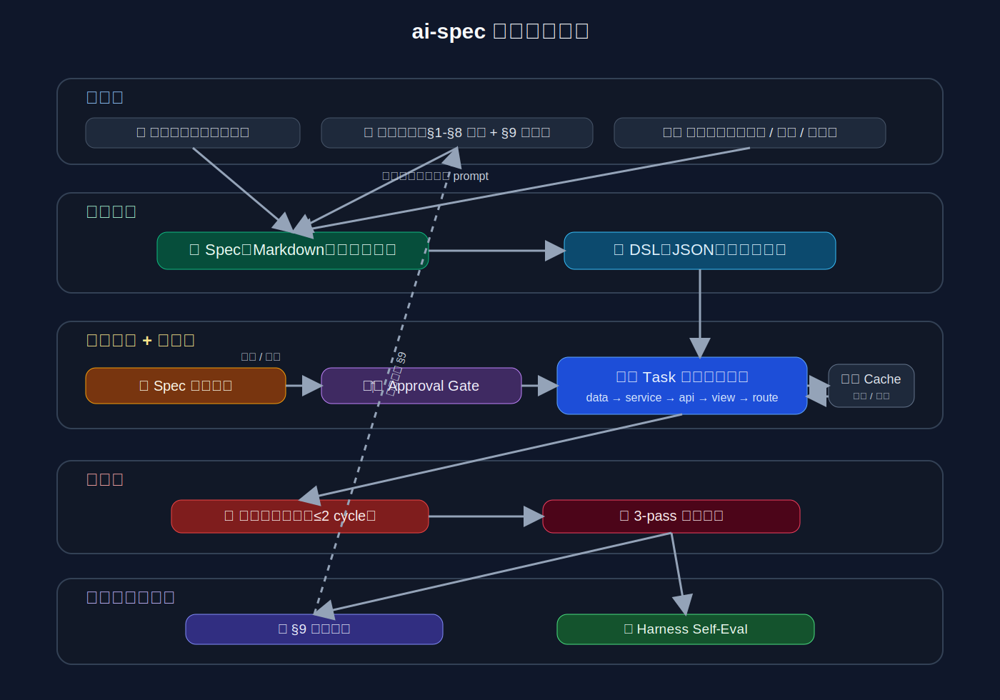

<p align="center">
  
</p>

<h1 align="center">ai-spec</h1>

<p align="center">
  <strong>AI-Driven Development Orchestrator</strong><br/>
  From a single sentence to production-ready code — the complete development pipeline.
</p>

<p align="center">
  <a href="https://github.com/hzhongzhong/ai-spec"></a>
  <a href="https://www.npmjs.com/package/ai-spec-dev"></a>
  
  
  
  
</p>

<p align="center">
  <a href="#english">English</a> | <a href="#中文文档">中文</a>
</p>

<p align="center">
  
</p>

---

<h2 id="english">English</h2>

### What is ai-spec?

**ai-spec** is an AI-driven development orchestrator SDK & CLI that transforms a one-line requirement into production-ready code through a fully automated pipeline:

```
init: Register Repos → Project Constitutions → Global Constitution
create: Requirement → Select Repo(s) → Context → Spec + Tasks → Refinement
→ Quality Assessment → Approval Gate → DSL Extraction → Gap Feedback
→ Git Isolation → Code Generation → TDD / Test Skeleton → Auto Error Fix
→ 3-Pass Code Review → Review→DSL Loop → Harness Self-Eval
```

**Multi-Repo mode (Workspace):**

```
One requirement → AI splits responsibilities → [Backend pipeline → DSL contract]
→ [Frontend pipeline (injected with backend contract)] → Full-stack complete
```

### Key Features

| Feature | Description |
|---------|-------------|
| **Two-Layer Contract** | Human-readable Spec + machine-readable DSL — bridging intent and implementation |
| **9 AI Providers** | Gemini, Claude, OpenAI, DeepSeek, Qwen, GLM, MiniMax, Doubao, MiMo |
| **Task-Layered Codegen** | `data → infra → service → api → view → route → test` — structured generation |
| **Project Constitution** | Self-evolving knowledge base (§1–§9) — AI learns from every review |
| **Dual Feedback Loops** | DSL Gap Loop + Review→DSL Loop — continuous contract refinement |
| **Harness Self-Eval** | Automated scoring: compliance 30% + DSL coverage 25% + compile 20% + review 25% |
| **VCR Recording** | Record & replay AI responses — zero-cost pipeline iteration |
| **Mock Server** | DSL → Express mock server + MSW handlers + proxy config — instant frontend dev |
| **OpenAPI Export** | DSL → OpenAPI 3.1.0 YAML/JSON — plug into Postman, Swagger UI, SDK generators |
| **Multi-Repo Workspace** | Cross-repo orchestration — backend DSL contract injected into frontend pipeline |

### Quick Start

```bash
# Install & build
npm install
npm run build

# Set API key (Gemini example)
export GEMINI_API_KEY=your_key_here

# Initialize: register repos + generate constitutions
ai-spec init

# Start developing (select registered repo → run pipeline)
ai-spec create "Add login functionality to user module"
```

### Pipeline Demo

```
[Repo]  Select repo(s) for this feature:
        ● my-vue-app (vue / frontend)
        ○ my-node-api (node-express / backend)
        ✔ 1 repo selected
[1/6]   Loading project context...
        Constitution : ✔ found
[2/6]   Generating spec with gemini/gemini-2.5-pro...
        ✔ Spec generated.  ✔ 7 tasks generated.
[3/6]   Interactive spec refinement...
        AI Changes ── +12 -3 lines
[3.4/6] Spec quality assessment...
        Coverage    [████████░░]  8/10
        Clarity     [██████░░░░]  6/10
        Constitution[█████████░]  9/10
[DSL]   Extracting structured DSL...
        ✔ DSL valid — Models: 2  Endpoints: 4  Behaviors: 1
[6/6]   Code generation (task-by-task)...
        [████████████████████]  100% → 8/8 files written
[7/10]  Test skeleton → 2 test files generated
[8/10]  Error feedback → auto-fixed 3 errors in 2 cycles
[9/10]  3-pass code review → Score: 7.8/10
[10/10] Harness Self-Eval → 7.8/10
        ✔ 2 lesson(s) → constitution §9
```

### Supported Providers

| Provider | Keyword | Env Variable | Default Model |
|----------|---------|-------------|---------------|
| MiMo (Xiaomi) | `mimo` | `MIMO_API_KEY` | `mimo-v2-pro` |
| Google Gemini | `gemini` | `GEMINI_API_KEY` | `gemini-2.5-pro` |
| Anthropic Claude | `claude` | `ANTHROPIC_API_KEY` | `claude-opus-4-6` |
| OpenAI | `openai` | `OPENAI_API_KEY` | `o3` |
| DeepSeek | `deepseek` | `DEEPSEEK_API_KEY` | `deepseek-chat` |
| Qwen | `qwen` | `DASHSCOPE_API_KEY` | `qwen3-235b-a22b` |
| GLM (Zhipu) | `glm` | `ZHIPU_API_KEY` | `glm-5` |
| MiniMax | `minimax` | `MINIMAX_API_KEY` | `MiniMax-Text-2.7` |
| Doubao | `doubao` | `ARK_API_KEY` | `doubao-pro-256k` |

### Commands

```
# Core workflow
ai-spec init                       Register repos, generate constitutions (auto-scans projects)
ai-spec init --add-repo            Quick-add a single repo
ai-spec init --status              Show registered repos and constitution health
ai-spec create [idea]              Full pipeline: spec → DSL → codegen → review
ai-spec create [idea] --openapi    Also auto-generate OpenAPI 3.1.0 YAML after DSL
ai-spec create [idea] --types      Also auto-generate TypeScript types after DSL
ai-spec update [change]            Incremental: modify spec → re-extract DSL → regen affected files
ai-spec review [file]              3-pass AI code review (architecture + implementation + impact)

# Knowledge & constitution
ai-spec learn [lesson]             Inject a lesson directly into constitution §9

# DSL-derived artifacts
ai-spec export                     DSL → OpenAPI 3.1.0 YAML/JSON
ai-spec types                      DSL → TypeScript types (models + endpoint types + API_ENDPOINTS)
ai-spec mock                       DSL → Mock server + MSW handlers + proxy config

# Configuration (run without flags for interactive model/provider picker)
ai-spec config                     Interactive provider/model setup (merged from `model`)
ai-spec config --show              Print current configuration
ai-spec config --list              List all available providers and models

# Observability
ai-spec logs [runId]               View run history or stage breakdown
ai-spec trend                      Harness score trend across runs
ai-spec dashboard                  Generate static HTML harness dashboard
ai-spec restore <runId>            Rollback all files modified by a specific run
ai-spec vcr list                   List VCR recordings
```

### Architecture

```
┌─────────────────────────────────────────────────────────────────┐
│                        ai-spec Pipeline                         │
├─────────┬──────────┬──────────┬──────────┬──────────┬──────────┤
│ Context │   Spec   │   DSL    │ Codegen  │  Review  │  Eval    │
│ Loader  │Generator │Extractor │Generator │  3-Pass  │ Harness  │
│         │ + Tasks  │+Validate │Task-by-  │+Feedback │Self-Eval │
│         │          │+Gap Loop │  Task    │  Loop    │+Memory   │
├─────────┴──────────┴──────────┴──────────┴──────────┴──────────┤
│                     Provider Abstraction Layer                   │
│  Gemini │ Claude │ OpenAI │ DeepSeek │ Qwen │ GLM │ ... (×9)   │
├─────────────────────────────────────────────────────────────────┤
│                      Output Generators                          │
│   OpenAPI Export │ TypeScript Types │ Mock Server │ Dashboard    │
└─────────────────────────────────────────────────────────────────┘
```

### Two-Layer Contract System

```
┌──────────────────────┐     ┌──────────────────────┐
│   Feature Spec (md)  │     │   SpecDSL (json)     │
│                      │     │                      │
│  Human-readable      │────▶│  Machine-readable    │
│  Requirements doc    │     │  Structured contract │
│  Reviewed by humans  │     │  Consumed by tools   │
└──────────────────────┘     └──────────────────────┘
        │                            │
        ▼                            ▼
  Code Generation              OpenAPI / Types /
  (with DSL context)           Mock Server / SDK
```

### Project Structure

```
ai-spec/
├── cli/                    # CLI commands (commander.js)
│   ├── commands/           # create, init, review, mock, export, ...
│   └── index.ts            # Entry point
├── core/                   # Core engine modules
│   ├── spec-generator.ts   # 9-provider AI abstraction
│   ├── dsl-extractor.ts    # Spec → DSL extraction
│   ├── dsl-validator.ts    # Schema validation (no deps)
│   ├── code-generator.ts   # Task-layered code generation
│   ├── reviewer.ts         # 3-pass code review
│   ├── self-evaluator.ts   # Harness scoring
│   ├── vcr.ts              # Record & replay
│   ├── mock-server-generator.ts
│   ├── types-generator.ts
│   ├── openapi-exporter.ts
│   └── ...                 # 25+ modules
├── prompts/                # All AI prompts (separated from logic)
├── tests/                  # 18 test files, 409 test cases
└── docs-assets/            # Architecture diagrams
```

### License

MIT

---

<h2 id="中文文档">中文文档</h2>

### ai-spec 是什么？

**ai-spec** 是一个 AI 驱动的功能开发编排工具 SDK & CLI —— 从一句话需求到可运行代码的完整流水线，支持单 Repo 及多 Repo 跨端联动。

```
init: 注册仓库 → 项目级宪法 → 全局宪法汇总
create: 需求描述 → 选择仓库 → 项目感知 → Spec+Tasks → 交互式润色(Diff预览)
→ Spec质量预评估 → Approval Gate → DSL提取+校验 → DSL Gap Feedback
→ Git 隔离 → 代码生成(同层并行) → TDD测试/测试骨架 → 错误反馈自动修复
→ 3-pass 代码审查 → Review→DSL Loop → Harness Self-Eval
```

**多 Repo 模式（工作区）：**

```
一句需求 → AI 拆分职责+UX决策 → [后端流水线 → DSL契约]
→ [前端流水线（注入后端契约）] → 全链路完成
```

### 核心特性

| 特性 | 描述 |
|------|------|
| **双层契约体系** | 人类可读 Spec + 机器可读 DSL —— 打通意图与实现 |
| **9 大 AI 供应商** | Gemini、Claude、OpenAI、DeepSeek、通义千问、智谱GLM、MiniMax、豆包、MiMo |
| **分层任务代码生成** | `data → infra → service → api → view → route → test` 结构化生成 |
| **项目宪法** | 自进化知识库（§1–§9）—— AI 从每次审查中学习 |
| **双反馈环** | DSL Gap Loop + Review→DSL Loop —— 持续契约精炼 |
| **Harness 自评** | 自动化评分：合规性 30% + DSL覆盖 25% + 编译 20% + 审查 25% |
| **VCR 录制回放** | 录制并回放 AI 响应 —— 零成本流水线迭代 |
| **Mock 服务器** | DSL → Express Mock + MSW Handlers + 代理配置 —— 前端即时联调 |
| **OpenAPI 导出** | DSL → OpenAPI 3.1.0 YAML/JSON —— 对接 Postman、Swagger UI、SDK 生成器 |
| **多 Repo 工作区** | 跨仓库编排 —— 后端 DSL 契约自动注入前端流水线 |

### 快速开始

```bash
# 安装依赖 & 构建
npm install
npm run build

# 设置 API Key（以 Gemini 为例）
export GEMINI_API_KEY=your_key_here

# 初始化：注册仓库 + 生成宪法链路
ai-spec init

# 开始开发（选择已注册仓库 → 跑 pipeline）
ai-spec create "给用户模块增加登录功能"
```

### 流水线演示

```
[Repo]  选择本次开发的仓库:
        ● my-vue-app (vue / frontend)
        ○ my-node-api (node-express / backend)
        ✔ 已选择 1 个仓库
[1/6]   加载项目上下文...
        Constitution : ✔ found
[2/6]   使用 gemini/gemini-2.5-pro 生成 Spec...
        ✔ Spec 已生成  ✔ 7 个任务已分解
[3/6]   交互式 Spec 润色...
        AI Changes ── +12 -3 lines
[3.4/6] Spec 质量预评估...
        覆盖度  [████████░░]  8/10
        清晰度  [██████░░░░]  6/10
        一致性  [█████████░]  9/10
[DSL]   提取结构化 DSL...
        ✔ DSL 校验通过 — 模型: 2  端点: 4  行为: 1
[6/6]   代码生成（逐任务）...
        [████████████████████]  100% → 8/8 文件已写入
[7/10]  测试骨架 → 2 个测试文件
[8/10]  错误反馈 → 自动修复 3 个错误，2 轮完成
[9/10]  3-pass 代码审查 → 评分: 7.8/10
[10/10] Harness 自评 → 7.8/10
        ✔ 2 条经验 → 宪法 §9
```

### 支持的模型

| Provider | 关键词 | API Key 环境变量 | 默认模型 |
|----------|--------|-----------------|----------|
| MiMo (小米) | `mimo` | `MIMO_API_KEY` | `mimo-v2-pro` |
| Google Gemini | `gemini` | `GEMINI_API_KEY` | `gemini-2.5-pro` |
| Anthropic Claude | `claude` | `ANTHROPIC_API_KEY` | `claude-opus-4-6` |
| OpenAI | `openai` | `OPENAI_API_KEY` | `o3` |
| DeepSeek | `deepseek` | `DEEPSEEK_API_KEY` | `deepseek-chat` |
| 通义千问 | `qwen` | `DASHSCOPE_API_KEY` | `qwen3-235b-a22b` |
| 智谱 GLM | `glm` | `ZHIPU_API_KEY` | `glm-5` |
| MiniMax | `minimax` | `MINIMAX_API_KEY` | `MiniMax-Text-2.7` |
| 豆包 Doubao | `doubao` | `ARK_API_KEY` | `doubao-pro-256k` |

<details>
<summary>各 Provider 完整模型列表</summary>

| Provider | 模型列表 |
|----------|---------|
| mimo | `mimo-v2-pro` |
| gemini | `gemini-2.5-pro` · `gemini-2.5-flash` · `gemini-2.0-flash` · `gemini-2.0-flash-lite` · `gemini-1.5-pro` |
| claude | `claude-opus-4-6` · `claude-sonnet-4-6` · `claude-haiku-4-5` · `claude-3-7-sonnet-20250219` |
| openai | `o3` · `o3-mini` · `o1` · `o1-mini` · `gpt-4o` · `gpt-4o-mini` |
| deepseek | `deepseek-chat`（V3）· `deepseek-reasoner`（R1） |
| qwen | `qwen3-235b-a22b` · `qwen3-72b` · `qwen3-32b` · `qwen3-8b` · `qwen-max` · `qwen-plus` |
| glm | `glm-5` · `glm-5-flash` · `glm-z1` · `glm-z1-flash` · `glm-4-plus` · `glm-4-flash` |
| minimax | `MiniMax-Text-2.7` · `MiniMax-Text-01` · `abab6.5s-chat` |
| doubao | `doubao-pro-256k` · `doubao-pro-128k` · `doubao-pro-32k` · `doubao-lite-128k` |

</details>

### 命令总览

```
# 核心开发流程
ai-spec init                       注册仓库，生成项目宪法 + 全局宪法（自动扫描项目）
ai-spec init --add-repo            快速添加单个仓库
ai-spec init --status              查看已注册仓库和宪法状态
ai-spec create [idea]              完整流水线：spec → DSL → 代码生成 → 审查
ai-spec create [idea] --openapi    DSL 提取后自动生成 OpenAPI 3.1.0 YAML
ai-spec create [idea] --types      DSL 提取后自动生成 TypeScript 类型文件
ai-spec update [change]            增量更新：修改 Spec → 重提取 DSL → 重新生成受影响文件
ai-spec review [file]              3-pass AI 代码审查（架构 + 实现 + 影响面）

# 知识 & 宪法
ai-spec learn [lesson]             零摩擦知识注入，直接写入宪法 §9

# DSL 衍生产物
ai-spec export                     DSL → OpenAPI 3.1.0 YAML/JSON
ai-spec types                      DSL → TypeScript 类型文件
ai-spec mock                       DSL → Mock 服务器 + MSW Handlers + 代理配置

# 配置（无参数运行进入交互式 provider/model 选择）
ai-spec config                     交互式 provider/model 配置（已合并原 model 命令）
ai-spec config --show              查看当前配置
ai-spec config --list              列出所有可用 provider 和模型

# 可观测性
ai-spec logs [runId]               查看 run 历史 / 指定 run 的 stage 详情
ai-spec trend                      Harness score 趋势分析
ai-spec dashboard                  生成静态 HTML Harness Dashboard
ai-spec restore <runId>            回滚指定 run 修改的所有文件
ai-spec vcr list                   列出 VCR 录制
```

<details>
<summary>命令详细选项</summary>

#### `ai-spec create`

```
ai-spec create "功能描述"            # 最简用法

# Provider / Model
--provider <name>                   # Spec 生成使用的 provider（默认 gemini）
--model <name>                      # Spec 生成使用的模型
--codegen-provider <name>           # 代码生成使用的 provider
--codegen-model <name>              # 代码生成使用的模型
--codegen <mode>                    # claude-code | api | plan

# 流程控制
--fast                              # 跳过 Spec 交互式润色
--auto                              # 全自动非交互模式
--resume                            # 续跑：跳过已完成 task
--tdd                               # TDD 模式

# 跳过步骤
--skip-worktree                     # 跳过 git worktree
--skip-tasks                        # 跳过 Tasks 分解
--skip-dsl                          # 跳过 DSL 提取
--skip-tests                        # 跳过测试生成
--skip-error-feedback               # 跳过错误反馈
--skip-review                       # 跳过代码审查
--skip-assessment                   # 跳过质量评估
--force                             # 绕过质量门槛
```

#### `ai-spec update`

```
ai-spec update "变更描述"               # 自动找最新 Spec
ai-spec update --codegen               # 更新后自动重新生成受影响文件
ai-spec update --spec <path>           # 指定 Spec 文件
ai-spec update --skip-affected         # 跳过受影响文件识别
```

#### `ai-spec mock`

```
ai-spec mock                           # 生成 mock/server.js
ai-spec mock --port 3002               # 指定端口
ai-spec mock --proxy                   # 生成前端 Proxy 配置
ai-spec mock --msw                     # 生成 MSW Handlers
ai-spec mock --serve --frontend <path> # 一键启动 + patch 前端 Proxy
ai-spec mock --restore --frontend <path> # 撤销 Proxy patch
```

#### `ai-spec export`

```
ai-spec export                         # 生成 openapi.yaml
ai-spec export --format json           # JSON 格式
ai-spec export --server <url>          # 指定服务器 URL
```

</details>

### 工作流详解

<details>
<summary>Step 0 — 初始化（ai-spec init）</summary>

`ai-spec init` 完成工作区准备：

1. **注册仓库**：输入仓库绝对路径 → 自动检测类型/角色（Vue/React/Node/Java/...）
2. **生成项目宪法**：对每个仓库自动扫描并生成 `.ai-spec-constitution.md`（§1–§9）
3. **生成全局宪法**：汇总所有仓库的项目宪法要点 → 生成 `.ai-spec-global-constitution.md`

宪法链路：**仓库注册 → 项目宪法 → 全局宪法汇总**，运行时自动 merge（全局为基线，项目级覆盖）。

`--add-repo` 支持快速追加仓库，`--consolidate` 将 §9 积累经验提炼归并到 §1–§8。
</details>

<details>
<summary>Step 2 — Spec 生成 + Tasks 分解</summary>

Spec 按结构化模板生成：功能概述 → 背景动机 → 用户故事 → 功能需求 → API 设计 → 数据模型 → 非功能性需求 → 实施要点。

Tasks 按实施层级排序：`data → infra → service → api → test`，代码生成时逐任务执行。
</details>

<details>
<summary>Step 3 — 交互式润色 + 质量评估 + Approval Gate</summary>

- **润色**：AI Polish 后展示彩色 diff，支持多轮编辑
- **质量评估**：Coverage / Clarity / Constitution 三维度 0-10 评分
- **Approval Gate**：展示版本差异，确认后进入代码生成
</details>

<details>
<summary>Step DSL — 双层契约提取</summary>

Spec → SpecDSL JSON（models + endpoints + behaviors + components）。内置校验（无外部依赖）、自动重试、前端/后端自动分叉。DSL Gap Feedback 检测稀疏契约并定向补全。
</details>

<details>
<summary>Step 6–10 — 代码生成 → 审查 → 自评</summary>

- **代码生成**：逐任务生成，DSL 上下文注入，支持 `claude-code` / `api` / `plan` 三种模式
- **测试骨架**：自动生成测试文件，TDD 模式支持真实断言
- **错误反馈**：自动捕获编译/测试错误，AI 定向修复，最多循环 2–3 轮
- **3-Pass 审查**：架构层 → 实现层 → 影响面/复杂度，结构性问题反写 DSL
- **Harness 自评**：合规性 + DSL覆盖 + 编译 + 审查 四维评分
- **经验积累**：审查发现的 issue 自动写入宪法 §9
</details>

### 架构总览

```
┌─────────────────────────────────────────────────────────────────┐
│                        ai-spec Pipeline                         │
├─────────┬──────────┬──────────┬──────────┬──────────┬──────────┤
│ Context │   Spec   │   DSL    │ Codegen  │  Review  │  Eval    │
│ Loader  │Generator │Extractor │Generator │  3-Pass  │ Harness  │
│         │ + Tasks  │+Validate │Task-by-  │+Feedback │Self-Eval │
│         │          │+Gap Loop │  Task    │  Loop    │+Memory   │
├─────────┴──────────┴──────────┴──────────┴──────────┴──────────┤
│                     Provider 抽象层                               │
│  Gemini │ Claude │ OpenAI │ DeepSeek │ Qwen │ GLM │ ... (×9)   │
├─────────────────────────────────────────────────────────────────┤
│                       输出生成器                                   │
│  OpenAPI 导出 │ TypeScript 类型 │ Mock 服务器 │ Dashboard          │
└─────────────────────────────────────────────────────────────────┘
```

### 项目结构

```
ai-spec/
├── cli/                    # CLI 命令层（commander.js）
│   ├── commands/           # create, init, review, mock, export, ...
│   └── index.ts            # 入口
├── core/                   # 核心引擎（25+ 模块）
│   ├── spec-generator.ts   # 9 Provider AI 抽象
│   ├── dsl-extractor.ts    # Spec → DSL 提取
│   ├── dsl-validator.ts    # Schema 校验（无外部依赖）
│   ├── code-generator.ts   # 分层任务代码生成
│   ├── reviewer.ts         # 3-pass 代码审查
│   ├── self-evaluator.ts   # Harness 评分
│   ├── vcr.ts              # 录制与回放
│   ├── mock-server-generator.ts
│   ├── types-generator.ts
│   ├── openapi-exporter.ts
│   └── ...
├── prompts/                # 所有 AI Prompt（与逻辑分离）
├── tests/                  # 18 个测试文件，409 个测试用例
└── docs-assets/            # 架构图
```

### License

MIT

---

<p align="center">
  Built with AI, for AI-driven development.<br/>
  <a href="https://github.com/hzhongzhong/ai-spec">github.com/hzhongzhong/ai-spec</a>
</p>
