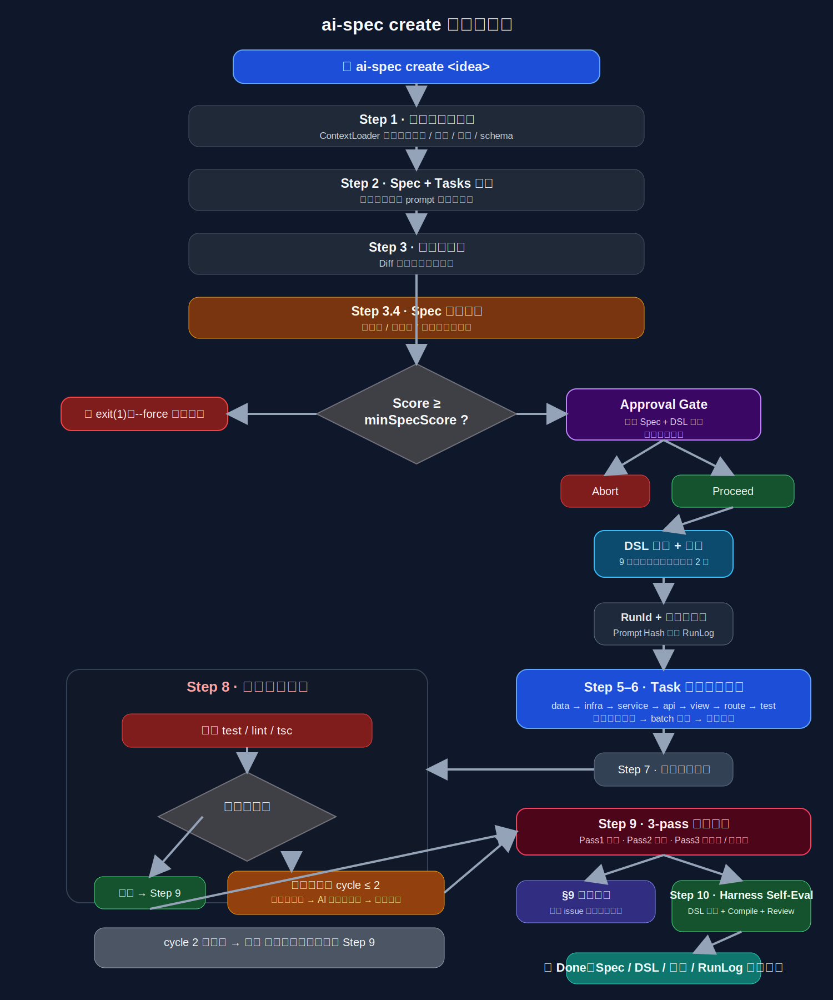
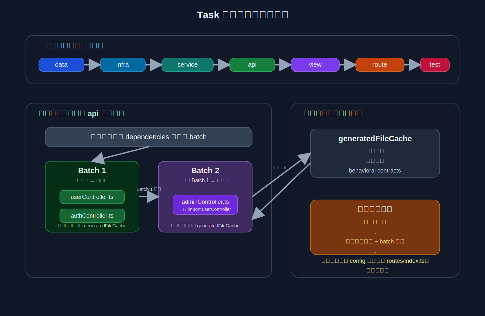

# ai-spec 设计思考文档

<details open>
<summary>中文</summary>

> 痛点 · 架构创新 · 边界处理 · DSL 的意义 · 当前局限 · 未来方向
>
> 当前版本：v0.38.0 · 最后更新：2026-04-02

***

## 目录

1. [这个工具在解决什么问题](#1-这个工具在解决什么问题)
2. [核心架构设计](#2-核心架构设计)
   - 2.11 [工业级可靠性基础设施（v0.27.0+）](#211-工业级可靠性基础设施v0270)
   - 2.12 [3-pass 代码审查（v0.28.0+）](#212-3-pass-代码审查v0280)
   - 2.13 [Harness Engineer：从 Prompt Hash 到质量数据闭环（v0.31.0+）](#213-harness-engineer从-prompt-hash-到质量数据闭环v0310)
   - 2.14 [两条 Pipeline 反馈环：让流水线可纠偏（v0.33.0+）](#214-两条-pipeline-反馈环让流水线可纠偏v0330)
   - 2.15 [DSL 的多出口价值：类型、Dashboard 与可观测性（v0.34.0+）](#215-dsl-的多出口价值类型dashboard-与可观测性v0340)
   - 2.16 [Pipeline 可靠性强化与 VCR 离线回放（v0.35.0+）](#216-pipeline-可靠性强化与-vcr-离线回放v0350)
   - 2.17 [安全加固 + 测试工程化 + 质量门禁（v0.36.0–v0.37.0）](#217-安全加固--测试工程化--质量门禁v0360v0370)
   - 2.18 [Design Options Dialogue + Pass 0 Spec Compliance + 项目索引（v0.38.0）](#218-design-options-dialogue--pass-0-spec-compliance--项目索引v0380)
3. [DSL 层的意义](#3-dsl-层的意义)
4. [完整功能矩阵](#4-完整功能矩阵)
5. [边界情况与兜底机制](#5-边界情况与兜底机制)
6. [适合哪些项目](#6-适合哪些项目)
7. [当前局限](#7-当前局限)
8. [未来优化方向](#8-未来优化方向)

> **版本记录速览**：v0.17.0 宪法截断修复 · v0.18.0 `learn` + `minSpecScore` + 行为契约提取 · v0.19.0 错误解析重写 + Auto Gate 修复 · v0.20.0 `mock --serve` 一键联调 · v0.21.0 store 公开 API 提取修复 · v0.22.0 service/api 层分离 · v0.23.0 view/route 双层 + 文件名幻觉修复 · v0.24.0 四项质量修复（export default、impliesRegistration、依赖拓扑排序、lesson 计数）· v0.25.0 HTTP import 正则、分页提取、isToolCrash 三项修复 · v0.26.0 多仓库 review 目录、batch 容错、tasks JSON 健壮性 · **v0.27.0 可靠性三件套**（Provider retry/timeout/分类、文件快照 + `restore`、RunId 结构化日志）· **v0.28.0 3-pass review**（Pass 3 影响面评估 + 代码复杂度评估）· **v0.29.0 全量审查修复**（RunLogger 完整插桩、update 快照/日志/knowledge、Score Trend 显示影响/复杂度等级、死代码清理）· **v0.30.0 错误修复依赖图排序 + 前端 Import 多行感知解析** · **v0.31.0 Harness Engineer：Prompt Hash + Create 内联 Self-Eval** · **v0.32.0 logs / trend + DSL Coverage 细化评分** · **v0.33.0 两条 Pipeline 反馈环（DSL Gap Loop + Review→DSL Loop）** · **v0.34.0 Harness Dashboard + DSL → TypeScript 类型生成** · **v0.35.0 VCR 录制回放 + JSONL 崩溃恢复 + 熔断 + §9 知识闭环 + Approval Gate 预估** · **v0.36.0 Shell 注入防护 + API Key 权限时序 + DSL 唯一性校验 + 核心模块测试覆盖** · **v0.36.1 质量硬门禁（minHarnessScore + maxErrorCycles）+ Provider 错误诊断增强** · **v0.37.0 Mock/Types/VCR 测试覆盖（409 cases / 18 modules / 45%）** · **v0.38.0 Design Options Dialogue + Pass 0 Spec Compliance + 项目索引 scan + 抗幻觉 Skills + Task verificationSteps**

***

## 1. 这个工具在解决什么问题

在 AI 代码生成工具已经泛滥的今天，ai-spec 试图回答的问题不是「AI 能不能写代码」，而是「AI 写出的代码能不能直接用在一个真实运行的、有历史包袱的工程项目里」。这两件事之间有一道非常现实的鸿沟。

### 1.1 现有 AI 编码工具的根本局限

几乎所有 AI 代码生成工具都面临同样的结构性困境：

| 局限               | 描述                                                                                         |
| ---------------- | ------------------------------------------------------------------------------------------ |
| **没有项目记忆**       | AI 不知道这个项目的错误码体系是什么，不知道认证中间件挂在哪里，不知道 i18n 文件只有一个不能新建。每次对话都是从零开始，生成的代码像是一个从来没看过这个项目的新人写的    |
| **缺乏结构化中间层**     | 从一段自然语言描述直接跳到代码，中间没有任何可审查、可版本化的契约。需求理解有偏差，你在代码里才会发现——代价极高                                  |
| **生成粒度太粗**       | 一次性让 AI 生成一个完整功能的所有文件，任何一个文件出错都可能导致整体失败。没有断点续传，失败就要从头来                                     |
| **生成即结束**        | 代码生成完成后工具就退出了。有没有通过测试？有没有 lint 错误？架构是否符合规范？只能靠人去回答                                         |
| **经验不断流失**       | 这次代码审查发现了一个安全漏洞，下次 AI 还会犯同样的错误。团队积累的工程经验无法系统性地约束 AI 的行为                                    |
| **跨 task 一致性缺失** | 多个文件由多次独立 AI 调用生成，各 task 之间不共享上下文。Task B 生成的路由文件会对 Task A 刚生成的 API 函数名产生幻觉——即使函数就在同一个 PR 里 |

### 1.2 ai-spec 的应对策略

ai-spec 对每个痛点都有对应的架构设计，不是功能堆砌，而是一套完整的解决思路：

| 痛点         | ai-spec 的解法          | 核心机制                                                  |
| ---------- | -------------------- | ----------------------------------------------------- |
| 没有项目记忆     | 项目宪法系统               | `.ai-spec-constitution.md` 自动注入所有 prompt，§9 随审查持续进化   |
| 缺乏结构化中间层   | Spec + DSL 双层契约      | Markdown Spec 供人审查，JSON DSL 供机器消费                     |
| 生成粒度太粗     | Task 分层 + 断点续传       | data→infra→service→api→test 层级，逐 task 生成 + `--resume` |
| 生成后无质量验证   | 错误反馈闭环               | 自动运行 test/lint → AI 修复 → 验证，最多 2 轮                    |
| 流水线纠偏成本高   | 局部反馈环                 | DSL 稀疏时先补 Spec 再提取；Review 发现结构性问题时先修契约再 `update --codegen` |
| 经验不断流失     | 知识记忆机制               | 审查 issue 自动写入宪法 §9，下次运行即生效；`init --consolidate` 定期精简  |
| 跨 task 一致性 | Generated File Cache | 已生成的 API/store 文件内容缓存，后续 task 可见真实导出名                 |
| 难以判断系统是否在变好 | Harness 可观测层 + 质量门禁  | `promptHash` + `harnessScore` + `logs/trend/dashboard` + `minHarnessScore` 阈值阻断，把生成质量变成可比较、可管控的数据 |

**核心定位**：ai-spec 不是代码补全工具，而是一个「AI 辅助工程流程编排器」。它的目标是让工程师用最少的时间获得一个符合项目规范、通过基本质检、可直接进入 Review 的代码分支。

### 1.3 整体架构鸟瞰

> 在进入各模块细节之前，先建立一个全局视图。


<details>
<summary>查看纯文本版</summary>

```text
输入层
  💬 需求描述（自然语言）
  📜 项目宪法（§1-§8 规则 + §9 教训）
  🗂️ 项目上下文（代码结构 / 依赖 / 路由）
          │
          ├──────────────→ 📄 Spec（Markdown，人类可读）
          │
          ├─ 宪法全文注入所有 prompt ───────→ 📄 Spec
          │
          └──────────────→ 📄 Spec

双层契约
  📄 Spec
    ↓
  🎯 Spec 质量评分（minSpecScore 阈值）
    ├─ 通过 → 🧑‍💻 Approval Gate（人工确认后才开始生成）
    │          ├─ Proceed → 📊 DSL（JSON，机器可读）
    │          └─ Abort   → 🚫 退出，无残留
    └─ 不足 → 🚫 中止

生成层
  📊 DSL
    ↓
  ⚙️ Task 分层代码生成（data→service→api→view→route，层内拓扑排序 + batch 并行）
    ↔ 🗄️ File Cache（行为契约 / 函数签名）

验证层
  Task 分层代码生成
    ↓
  🔄 错误反馈闭环（≤2 cycle · 依赖图排序修复）
    ↓
  🔬 3-pass 代码审查（架构 + 实现 + 影响面）

学习层（闭环）
  🔬 3-pass 代码审查
    ├─→ 📚 §9 知识积累（审查 issue 自动写入）
    │      └─→ 更新宪法 §9 → 📜 项目宪法
    └─→ 📈 Harness Self-Eval（harnessScore + promptHash）
```

</details>

***

## 2. 核心架构设计

### 2.0 `ai-spec create` 完整流水线

> 以下流程图展示了运行一次 `ai-spec create` 时所有步骤的完整执行路径，包括每个决策门和反馈循环。后续 §2.1—§2.13 各节是对图中各模块的深度解析。



<details>
<summary>查看纯文本版</summary>

```text
▶ ai-spec create <idea>
  ↓
Step 1 · 加载项目上下文
  ContextLoader 扫描代码结构 / 依赖 / 路由 / schema
  ↓
Step 1.5 · Design Options Dialogue（v0.38.0）
  AI 提出 2-3 个架构方案，用户选择后注入 spec prompt
  ↓
Step 2 · Spec + Tasks 生成
  宪法全文注入 prompt 最高优先级 + architectureDecision
  ↓
Step 3 · 交互式润色
  Diff 预览，可多轮修改
  ↓
Step 3.4 · Spec 质量评估
  覆盖度 / 清晰度 / 宪法符合度打分
  ↓
判断：Score ≥ minSpecScore ?
  ├─ 否 → 🚫 exit(1)（--force 可强制继续）
  └─ 是 → Approval Gate
           展示 Spec + DSL 摘要，等待人工决策
           ├─ Abort   → 🚫 退出，Spec 不写入磁盘
           └─ Proceed → DSL 提取 + 9 条规则校验（失败最多重试 2 次）
                        ↓
                      RunId 生成 + 文件快照初始化
                      Prompt Hash 写入 RunLog
                        ↓
                      Step 5–6 · Task 分层代码生成
                      data → infra → service → api → view → route → test
                      层内拓扑排序 → batch 并行 → 缓存更新
                        ↓
                      Step 7 · 测试骨架生成
                        ↓
                      Step 8 · 错误反馈闭环
                        ↓
                      运行 test / lint / tsc
                        ↓
                      判断：全部通过？
                        ├─ 通过 → Step 9 · Pass 0 合规 + 3-pass 代码审查
                        │          Pass1 架构 · Pass2 实现 · Pass3 影响面/复杂度
                        ├─ 有错误，且 cycle ≤ 2
                        │    → 依赖图排序
                        │    → AI 逐文件修复（携带 DSL 上下文）
                        │    → 回到 test / lint / tsc
                        └─ cycle 2 仍失败
                             → ⚠️ 黄色警告，继续
                             → Step 9 · Pass 0 合规 + 3-pass 代码审查
                                  ↓
                                §9 知识积累
                                审查 issue 自动追加宪法
                                  ↓
                                Step 10 · Harness Self-Eval
                                Compliance + DSL 覆盖 + Compile + Review → harnessScore
                                PromptHash 关联，零 AI 调用
                                  ↓
                                ✔ Done
                                Spec / DSL / 代码 / RunLog 全部落盘
```

</details>

***

### 2.1 项目宪法：可进化的项目记忆

绝大多数 AI 工具的「上下文注入」是静态的——你手动写一段 prompt，每次带进去。ai-spec 的宪法系统不同，它是一个会随项目迭代自动更新的活文档。

**宪法的生命周期：**

```
① ai-spec init
   └─ AI 扫描 routes / schema / middleware / package.json
       → 生成 §1-§8（架构 / 命名 / API / 数据层 / 错误处理 / 禁区 / 测试 / 共享文件清单）

② ai-spec create / review（日常运行）
   └─ 宪法全文注入 Spec 生成 prompt 的最高优先级位置
       → AI 输出天然符合项目规范和架构约束
       → 审查完成后，issue 自动追加到 §9

③ §9 累积到 8 条后，自动提示运行 ai-spec init --consolidate
   └─ LIFT：通用规则融入 §1-§8
      KEEP：近期特定条目，保留 ≤5 条
      DROP：重复或已过时的条目删除
   → 宪法总长度收敛，保持高信噪比
```

**两级宪法（v0.9+）**：支持全局宪法（`~/.ai-spec-global-constitution.md`）和项目宪法。生成时先注入全局宪法，再注入项目宪法，项目宪法优先级更高。适合维护多个服务的团队统一约定跨项目规范。

**核心设计思想**：不试图在一次 init 时就写出完美规范（这不可能），而是通过实际运行中发现的真实问题来持续完善约束。项目跑得越久，宪法越准确，AI 输出越可靠。

***

### 2.2 双层契约：Spec + DSL

在需求和代码之间插入两层中间产物，是 ai-spec 区别于其他工具最关键的架构决策之一：

| 层      | 产物                        | 服务对象        | 核心价值                   |
| ------ | ------------------------- | ----------- | ---------------------- |
| Spec 层 | `feature-xxx-v1.md`       | 人（工程师）      | 自然语言，供审查、对齐、留档，可版本化比较  |
| DSL 层  | `feature-xxx-v1.dsl.json` | 机器（AI / 工具） | 结构化契约，消除歧义，驱动代码生成和测试生成 |

- **没有 Spec 层直接生成代码**：AI 理解可能偏差，你在代码里才发现——代价高
- **没有 DSL 层只用 Spec 生成代码**：Markdown 是非结构化的，AI 需要反复从中解析信息——容易产生幻觉
- **两层并存**：人看 Spec 做决策，AI 读 DSL 做生成，职责分离

DSL 同时作为多个下游模块的共享契约：代码生成、测试骨架生成、错误修复 prompt、OpenAPI 导出、Mock Server 生成，全部以同一份 DSL 为准。

***

### 2.3 Approval Gate：人在正确位置介入

全自动流水线的最大风险不是「AI 写错了代码」，而是「AI 理解错了需求，写了很多正确但没用的代码」。

Approval Gate 设计在「Spec 润色完成 + DSL 提取完成」之后、「代码生成开始」之前：

- 此时你已经看到了完整的 Spec（人类可读），知道 AI 打算做什么
- 此时你还没有花任何代码生成的时间和 token
- 如果你 Abort，Spec 不会写入磁盘——没有任何残留
- 如果你 Proceed，后续所有步骤都有明确的 Spec 作为依据

**设计原则**：「人工确认」不应该发生在流程的末尾（代价已经发生了），也不应该发生在流程的开始（AI 的理解你还看不到）。应该发生在「信息刚好足够决策，代价还没有开始」的那个节点。

**Spec 质量预评估（v0.18.0+）**：在 Approval Gate 之前，增加了一个 AI 驱动的质量评分步骤，从「覆盖度」「清晰度」「宪法符合度」等维度打分（1-10）。`.ai-spec.json` 可以配置 `minSpecScore` 字段设置最低通过分：

```json
{ "minSpecScore": 7 }
```

- 低于阈值时，`create` 会打印具体不足项并 `exit(1)`（`--force` 可绕过）
- `--auto` 模式也会执行此检查（v0.19.0 修复了此前 `--auto` 绕过阈值的 bug）
- `minSpecScore: 0`（默认）= 禁用阈值，仅展示评分不阻断流程

***

### 2.4 Task 分层：依赖感知的生成顺序

代码生成的顺序不是随意的。ai-spec 按固定层级顺序生成，前端和后端共用同一套层级体系：

```
data → infra → service → api → view → route → test
```

| 层       | 后端含义                         | 前端含义                         |
| ------- | ---------------------------- | ---------------------------- |
| data    | DB schema、migrations、TS 类型定义 | 同左                           |
| infra   | 配置、环境变量、外部服务                 | 同左                           |
| service | 业务逻辑、service class           | HTTP API 调用文件（`src/api/`）    |
| api     | Controller、路由、中间件            | 状态管理 store（`src/stores/`）    |
| view    | —                            | 页面/视图组件（`src/views/`）        |
| route   | —                            | 路由模块文件（`src/router/routes/`） |
| test    | 单测、集成测试                      | 同左                           |

**执行模型图解：**



<details>
<summary>查看纯文本版</summary>

```text
七层顺序（跨层串行）
  data → infra → service → api → view → route → test

单层内部执行（以 api 层为例）
  1. 先做拓扑排序
     - 按 tasks.json 里的 dependencies 字段分 batch

  2. Batch 1（无依赖，可并行）
     - userController.ts
     - authController.ts
     - 执行完成后，更新 generatedFileCache

  3. Batch 2（依赖 Batch 1，可并行）
     - adminController.ts
       需要 import userController
     - 执行完成后，再更新 generatedFileCache

generatedFileCache 的作用
  - 记录函数签名
  - 记录文件路径
  - 记录 behavioral contracts
  - Batch 1 / Batch 2 都会读写它

整层执行关系
  进入当前层
    ↓
  层内拓扑排序 + batch 并行
    ↓
  层完成后统一更新共享 config 文件
  例如：routes/index.ts
    ↓
  进入下一层
```

</details>

> **为什么 route 必须在 view 之后？** view 完成后，`TaskManagement.vue` 的真实路径进入 FileCache；route task 生成时 prompt 里已经有 `// exists: src/views/task-management/TaskManagement.vue`，AI 不会再猜测 `index.vue`（v0.23.0 文件名幻觉修复）。

**前端四层链路设计（v0.22.0+）**：`service`（api 调用函数）→ `api`（store，导入 service 函数）→ `view`（页面，使用 store action）→ `route`（路由模块，导入 view 组件）。`route` 必须在 `view` 之后生成，因为路由文件需要知道 view 组件的确切文件名（如 `TaskManagement.vue` 而非猜测的 `index.vue`）——这是 v0.23.0 修复文件名幻觉的核心机制。

每个 task 完成后立即写入 `status: done` 到 `tasks.json`，`--resume` 标志让流水线跳过已完成 task，中断恢复精确到 task 粒度。`tasks.json` 文件损坏时（意外截断等）能检测并优雅降级，提示重新生成（v0.26.0）。

**同层并行 + 层内拓扑排序（v0.24.0+）**：同一层内的多个 task 通过 `Promise.all` 并发执行。若某 task 声明了对同层另一 task 的 `dependencies`，则先通过 Kahn 算法分拆为多个 batch，batch 间串行，batch 内并行；每个 batch 完成后立即更新 `generatedFileCache`，确保后续 batch 能看到前驱 task 的导出名。跨层依赖由层级顺序本身保障。单个 task 的意外异常（磁盘满、provider 超时）只影响自身，不中断同层其他 task（v0.26.0 `.catch` 降级）。共享配置文件（如 `routes/index.ts`）从并行 filePlan 中剥离，层完成后统一 batch update，避免并发覆写冲突。

***

### 2.5 错误反馈闭环

传统代码生成模型是「生成 → 结束」。ai-spec 引入了「生成 → 验证 → 修复 → 再验证」的循环：

```
代码生成完成
    │
    ▼
运行 npm test / npm run lint
    │
    ├─ 全部通过 ──→ 继续
    │
    └─ 有错误
           │
           ▼
       解析错误输出
       ├─ 扫描全文，只保留含 file:line 模式的行（v0.19.0 重写）
       ├─ 过滤 npm timing / node_modules / at stack trace 等噪音行
       └─ 最多取前 20 条有文件路径的可操作错误
       按文件分组，逐文件提交 AI 修复
       （prompt 携带：错误描述 + DSL 上下文 + 当前文件内容）
           │
           ▼
       写回文件 → 重新运行测试
           │
           ├─ 通过 ──→ 继续
           └─ 还有错误（cycle 2）──→ 再修复一轮
                   │
                   └─ 仍有错误 ──→ 黄色警告 + 继续（不中断）
```

**关键设计点**：

- 修复 prompt 中携带了 DSL 上下文，AI 修复时知道这个文件应该满足什么接口契约，避免了「把错误藏起来」式的修复
- v0.19.0 之前的实现取输出的「最后 80 行」，TypeScript / Jest 错误结构是「具体 file:line 在前，摘要在后」，导致取到的全是摘要，AI 修复的是摘要描述而不是实际错误位置。v0.19.0 重写为全文扫描 + file:line 过滤，彻底解决了这个问题。
- **v0.30.0 — 依赖图排序修复**：旧版修复顺序由错误首次出现的顺序决定，与文件 import 关系无关。当 `serviceA.ts` 导出的类型被 `controllerB.ts`、`storeC.ts` 同时引用且三者均出错时，若 controller/store 先修复，修复 prompt 中的 service 仍是破损版本，cascade 错误只能等 cycle 2 处理。v0.30.0 新增 `buildRepairOrder()`：解析每个出错文件的相对 import 声明（跳过 `import type`），在出错文件子图上做 Kahn 拓扑排序，**被依赖文件优先修复**，有环依赖追加末尾。效果：cycle 1 可一次消除更多 cascade 错误，2 轮上限的利用率提升。

***

### 2.6 前端深度感知（Frontend Context）

前端项目有特殊的高幻觉风险区：HTTP client 导入路径、分页参数命名、路由模块注册方式、状态管理层与 API 层的职责划分。ai-spec 通过 `frontend-context-loader` 从项目现有代码中自动提取这些 ground-truth 信息并注入 prompt：

| 提取项                  | 注入方式                                            | 解决的问题                                                                  |
| -------------------- | ----------------------------------------------- | ---------------------------------------------------------------------- |
| `httpClientImport`   | "COPY THIS EXACTLY"                             | 防止 AI 用 `axios` 替换 `import http from '@/utils/http'`                   |
| `paginationExample`  | "COPY THIS EXACTLY for all paginated list APIs" | 防止 `pageIndex`/`pageSize` vs `page`/`size` 混用；防止 POST body 变 GET query |
| `layoutImport`       | "COPY THIS EXACTLY in every new route module"   | 防止路由模块使用错误的 Layout 路径                                                  |
| `routeModuleExample` | 完整文件作为模板                                        | 路由模块文件结构、命名、meta 字段保持一致                                                |
| `storePatterns`      | "stores call API layer, NOT HTTP directly"      | 防止 store 直接发起 HTTP 请求                                                  |
| `reusableComponents` | 枚举列表                                            | 防止重造已有组件                                                               |
| `pageExamples`       | 完整页面代码示例                                        | 让 AI 学习 UI 库组件的真实用法                                                    |

扫描覆盖范围：`src/api/`、`src/apis/`、`src/services/`、`src/router/`、`src/routes/`、`src/store/`、`src/stores/`、`src/components/`、`src/views/`、`src/pages/`。

**v0.25.0 提取质量修复：**

- **`httpClientImport`** **正则扩展**：旧版只识别 `axios`、`ky` 和 `@/` 路径，漏掉了所有使用 `~/`、`#/`、`@@/` 别名以及 `undici`、`got`、`alova` 等库的项目，提取结果为 `undefined` 时 AI 会自由发挥 import 路径。新版覆盖所有常见别名 + 路径含 http/request/fetch/client/api 关键词的相对 import + 完整 HTTP 库列表，并排除 `import type` 语句（仅类型导入，运行时无效）。
- **`paginationExample`** **逐行提取重写**：旧版正则用 `[^}]*` 匹配接口体，遇到嵌套对象字段（`filter: { status?: string }`）立即截断；函数匹配用 `\n\}` 要求闭合括号紧接换行，缩进的   `  }` 永远不匹配；且只支持 `export function`，遗漏了现代代码中更常见的 `export const = () =>` 写法。新版全部改为逐行扫描 + 大括号深度计数器，支持嵌套对象、任意缩进的闭合括号、arrow function，提取可靠性从「经常为空」提升到「能找到就找到」。

**v0.30.0 — 多行感知 Import 解析：**

v0.25.0 的正则扩展解决了模块路径识别范围的问题，但遗留了另一个结构性缺陷：**所有提取逻辑均假设 import 语句在单行内完成**。现代 TypeScript 项目中多行 named import 极为常见：

```typescript
// 这种写法在 v0.30.0 之前静默匹配失败
import {
  request,
  type RequestConfig,
} from '@/utils/http'
```

旧版正则 `[^}]+` 不跨换行符，遇到上述格式直接失败，`httpClientImport` 结果为 `undefined`，AI 回退到自由发挥。

**修复方案（不引入任何新依赖）**：

- `parseImportStatements(content)` — 先将文件中所有 `import { ... }` 块折叠为单行（正则 `/import\s*\{[^}]*\}/gs` + 替换换行），再逐行匹配并返回 `{ line, modulePath, specifiers }` 结构化对象，跳过 `import type`
- `HTTP_MODULE_PATTERNS` 数组 — 三类识别规则与 import 解析完全解耦，独立维护
- `findHttpClientImport()` — 组合两者，替换旧版一行式 `content.match(httpImportRegex)`
- `extractRouteModuleContext()` 中 `layoutImport` 的静态形式改走 `parseImportStatements()`；动态形式（`const Layout = defineAsyncComponent(...)`）增加多行折叠预处理，消除换行导致的漏匹配

***

### 2.7 跨 Task 一致性（Generated File Cache）

多文件功能由多次独立 AI 调用完成。Task B 的 AI 实例无法感知 Task A 刚写了什么——这是跨 task 函数名幻觉的根本原因（`getTaskList` 被猜成 `getTasks`）。

**解决方案**：`generatedFileCache` — 每个 task 完成后，将写入的文件读回并缓存到内存 Map（批次完成后更新，v0.24.0 引入批次级更新）；后续每个 task 的 prompt 中追加 `=== Files Already Generated in This Run ===` 区段。

缓存策略按文件类型分层（v0.23.0+）：

| 文件类型                                                         | 缓存内容                                                                   | 原因                    |
| ------------------------------------------------------------ | ---------------------------------------------------------------------- | --------------------- |
| `src/api*/`、`src/service*/`、`src/store*/`、`src/composable*/` | 完整文件内容（或提取的行为契约）                                                       | 下游 task 需要准确的函数名/类型签名 |
| `src/views*/`、`src/pages*/`                                  | 仅路径 sentinel：`// exists: src/views/task-management/TaskManagement.vue` | 路由 task 只需要组件的确切文件名   |

**文件名幻觉的根因与修复（v0.23.0）**：路由文件里的 `import('@/views/xxx/index.vue')` vs 实际的 `TaskManagement.vue` 是高频幻觉。根因是「route task 在 view task 之前生成，AI 猜不出文件名，fallback 到 `index.vue`」。`view` 层在 `route` 层之前完成，view 文件的路径 sentinel 进入缓存，route task 的 prompt 中已经有 `// exists: src/views/task-management/TaskManagement.vue`，配合 Rule 17 强制使用该确切路径，幻觉消除。

系统提示 Rule 17：`=== Files Already Generated ===` 区段中的导出函数名和文件路径是唯一权威来源，NEVER 重命名、猜测替代名、或将 `// exists:` 路径替换为 `index.vue` 等默认名。

**路由模块注册**：当 task 新建路由模块文件时，`routes/index.ts` 被注入为 shared config file，purpose 字段精确指定需要 import 的模块名，配合 Rule 16 强制要求 AI 同时更新 index 文件。`route`/`view`/`api` 层 task 创建新文件时无论 task 描述是否含关键词，均无条件触发注册更新（v0.24.0 层级直接判断修复，消除关键词匹配漏报）。

***

### 2.8 行为契约提取（Behavioral Contract，v0.18.0+）

跨 task 一致性的另一个维度：Task B 的 AI 不只需要知道「已生成了哪些文件」，还需要知道「这些文件里导出了什么、接受什么参数、会抛出什么异常」。`generatedFileCache` 存文件内容；`extractBehavioralContract` 从中蒸馏出精确的接口合约：

```typescript
// 提取逻辑（按优先级）：
// 1. 完整捕获 export interface / type X = { / class / abstract class / enum
//    → 使用大括号深度计数器直到对应 } 为止（v0.19.0 修复了只取第一行的 bug）
// 2. 完整捕获 export const X = defineStore/createStore/createSlice(...)
//    → 使用圆括号深度计数器，将整个 defineStore 调用体（含 return {}）捕获
//    → v0.21.0 修复：之前只捕获第一行，AI 看不到 return { fetchTasks } 导致猜成 fetchTaskList
// 3. 完整捕获 return { ... }（composable/store 公开 API）
//    → 标注 "// public API (return object):"，是消费者调用的唯一合法来源
//    → v0.21.0 新增
// 4. 完整捕获 export default function/class（React 组件、class 组件）
//    → v0.24.0 新增，与 defineStore 捕获对称
// 5. 单行 export function / export const / export type 签名
// 6. throw new XxxError / throw createXxx 模式（最多 20 条）
// 7. 所有以上均无法提取时，回退到文件前 3000 字符
```

**store/composable 文件特殊处理**：这类文件的「接口合约」不是类型签名，而是 `return {}` 里暴露的 action 名。`extractBehavioralContract` 对 store 文件会捕获整个 `defineStore(...)` 调用体，确保 `return { fetchTasks, createTask }` 可见，避免 AI 在调用 store 时发明 `fetchTaskList`、`addTask` 等替代名。

**为什么不直接传整个文件内容**：多 task 并行时，context 窗口压力大。一个 service 文件可能 500 行，但真正影响下游 task 的「接口合约」只有 20-30 行。蒸馏出来的 Behavioral Contract 让 AI 准确知道「我可以调用 `UserService.getUser(id: string): Promise<User | null>`」，而不是要从 500 行代码里自己推断。例外：store/composable 文件传完整内容，因为整个文件本身就是契约（action 名散布在函数体中，蒸馏后可能遗漏）。

### 2.9 `ai-spec learn`：零摩擦知识注入（v0.18.0+）

§9 的传统写入路径：`ai-spec review` → AI 分析代码 → 提取教训 → 写入 §9。这个路径涉及 AI 调用，需要 git diff，适合正式的代码审查。

`ai-spec learn` 提供了一条更轻量的路径：工程师在开发过程中随时发现问题，直接注入：

```bash
ai-spec learn "所有金额字段统一用 Decimal 类型，不能用 float"
ai-spec learn "登录态校验中间件是 authMiddleware，不是 verifyToken"
```

**设计约束**：

- 不调用 AI，纯本地文件操作
- 自动去重（内容相似度 > 80% 则跳过）
- §9 累积到 8 条时打印提示，建议运行 `init --consolidate`
- 与 review 写入的条目格式完全一致，`--consolidate` 统一处理

**适用场景**：架构决策、踩坑记录、项目特定约定——任何「下次 AI 不应该再犯的错」都可以立即注入，无需等到正式 review。

### 2.10 多语言后端支持

`ContextLoader` 自动识别项目技术栈，选择对应的代码生成 prompt：

| 语言 / 框架               | 识别方式                                  | Codegen Prompt 关键约束                                   |
| --------------------- | ------------------------------------- | ----------------------------------------------------- |
| Node.js / TypeScript  | `package.json`                        | 路由注册、Prisma schema、中间件挂载                              |
| PHP / Lumen / Laravel | `composer.json`                       | `import http` 封装、Eloquent、`routes/api.php` 注册         |
| Java / Spring Boot    | `pom.xml` / `build.gradle`            | Controller → Service → Repository 分层、Lombok、构造器注入     |
| Go                    | `go.mod`                              | 命名错误返回、`defer` 清理、context 传播                          |
| Python / FastAPI      | `requirements.txt` / `pyproject.toml` | Pydantic 模型、`APIRouter` 注册、type annotations           |
| Rust / Axum           | `Cargo.toml`                          | `Result<T,E>`、no `unwrap()` in production、tokio async |

### 2.11 工业级可靠性基础设施（v0.27.0+）

实验性工具和生产可用工具之间的差距，很大程度上体现在「出错时的行为」上。v0.27.0 引入三项底层可靠性机制：

**① Provider 重试 / 超时 / 错误分类（`provider-utils.ts`）**

所有 AI provider 调用统一通过 `withReliability()` 包装：

```
超时：90s（可配置）
重试：最多 2 次，指数退避（2s → 6s）
错误分类：auth（401/403，不重试）| rate_limit | timeout | network | provider
```

认证错误不重试（key 已无效，重试无意义）；网络抖动和限流错误重试。所有错误附带结构化的 `ProviderError`（含 `kind` 字段），上层可按 kind 差异化处理。

**② 写前文件快照 +** **`ai-spec restore <runId>`（`run-snapshot.ts`）**

每次生成运行生成唯一 `RunId`（格式：`YYYYMMDD-HHMMSS-xxxx`）。在写入任何文件之前，先将原始内容备份到 `.ai-spec-backup/<runId>/`（如果文件不存在则跳过）。

```bash
ai-spec restore 20260326-143022-a7f2
# → 将该 runId 覆盖的所有文件还原到生成前的状态
# → 打印每个还原文件的路径
```

**适用场景**：生成结果不满意、AI 覆盖了不该覆盖的文件、想对比生成前后差异时——无需 `git checkout`，一条命令精确还原。

**③ RunId + 结构化 JSON 日志（`run-logger.ts`）**

每次运行在 `.ai-spec-logs/<runId>.json` 写入结构化日志。日志包含：

- **`entries[]`** — 每个主要阶段的 `stageStart`/`stageEnd`/`stageFail` 事件，含各阶段 `durationMs` 和业务数据（v0.29.0 完整插桩）
- **`filesWritten[]`** — 本次运行写入的所有文件路径
- **`errors[]`** — 各阶段失败时记录的错误摘要

```json
{
  "runId": "20260326-143022-a7f2",
  "startedAt": "2026-03-26T14:30:22.000Z",
  "endedAt": "...",
  "totalDurationMs": 94310,
  "filesWritten": ["src/api/task.ts", "src/stores/taskStore.ts"],
  "entries": [
    { "event": "context_load",      "ts": "...", "data": { "techStack": ["node"], "repoType": "node-express" } },
    { "event": "context_load:done", "ts": "...", "data": { "durationMs": 312 } },
    { "event": "spec_gen",          "ts": "...", "data": { "provider": "gemini", "model": "gemini-2.5-pro" } },
    { "event": "spec_gen:done",     "ts": "...", "data": { "taskCount": 7, "durationMs": 18420 } },
    { "event": "dsl_extract",       "ts": "..." },
    { "event": "dsl_extract:done",  "ts": "...", "data": { "endpoints": 4, "models": 2, "durationMs": 6100 } },
    { "event": "codegen",           "ts": "...", "data": { "mode": "api" } },
    { "event": "codegen:done",      "ts": "...", "data": { "filesGenerated": 8, "durationMs": 51200 } },
    { "event": "review",            "ts": "..." },
    { "event": "review:done",       "ts": "...", "data": { "durationMs": 14800 } }
  ]
}
```

Run 结束后自动打印摘要（RunId、总耗时、写入文件数、日志路径）。日志供排查问题、统计各阶段耗时、追踪历史运行使用。

**覆盖范围（v0.29.0 扩展）**：`create` 命令 9 个阶段均已插桩；`update --codegen` 同样初始化独立 RunId，写文件前快照、写文件后记录，结束后打印摘要 + restore 提示，与 `create` 行为完全对齐。

***

### 2.12 3-pass 代码审查（v0.28.0+）

`ai-spec review` 从「2-pass」升级为「3-pass」，新增 Pass 3 影响面与复杂度评估：

| Pass                 | 关注维度                                           | 核心问题               |
| -------------------- | ---------------------------------------------- | ------------------ |
| **Pass 1 架构审查**      | Spec 符合度、层级分离、认证中间件使用                          | 这次改动是否破坏了架构边界？     |
| **Pass 2 实现审查**      | 参数校验、错误处理、边界值、历史问题复现检测                         | 实现细节是否健壮、有没有老问题重演？ |
| **Pass 3 影响面 + 复杂度** | 直接文件 / 间接传播范围 / Breaking Change / 认知复杂度 / 耦合分析 | 这次改动的波及范围和维护风险有多大？ |

**Pass 3 输出结构**：

```
影响面评估
  ├─ 直接文件：本次 diff 涉及的文件（逐一列出）
  ├─ 间接范围：调用这些文件的上游模块（分析依赖关系）
  ├─ Breaking Change 风险：接口签名 / 类型定义 / 错误码是否变更
  └─ 影响等级：低 | 中 | 高

代码复杂度评估
  ├─ 认知复杂度热点：嵌套层数深、条件分支多的函数（具体指出）
  ├─ 耦合分析：与多少个模块产生了新依赖
  ├─ 可维护性风险：魔法数字、职责混淆、测试困难点
  └─ 复杂度等级：低 | 中 | 高
```

**影响等级** 和 **复杂度等级** 被写入审查历史（`.ai-spec-reviews.json`），下次 review 的历史趋势图中可见，帮助团队长期追踪代码质量走势。

Pass 3 不重复 Pass 1 / Pass 2 的发现，而是站在更高的系统视角回答「这次 PR 的风险有多大、后续维护成本是多少」这两个问题。

***

### 2.13 Harness Engineer：从 Prompt Hash 到质量数据闭环（v0.31.0+）

#### 背景：ai-spec 不能只是“会生成代码”

v0.30.0 之前，ai-spec 已经具备了从 Spec 到代码的自动化能力，但它本质上还是一个**缺少量化反馈回路的生成 Harness**。你可以主观感受到某次生成“看起来不错”，却很难系统回答：

- 改了 codegen prompt 之后，整体质量到底是提升还是下降了？
- 哪个 provider / model 在当前项目上最稳定？
- 某次宪法、DSL、review 规则收紧之后，compile 通过率有没有变好？
- 最近 10 次生成里，分数下滑是 prompt 变了，还是模型随机波动？

这正是 **Harness Engineer** 视角要解决的问题：工程师不只是把 AI 工作流串起来，更要把它变成一个**可比较、可回看、可量化优化**的系统。

#### 设计转向：Harness Engineer 不再只是一个想法

现在这个设计已经不只停留在概念层。它已经开始进入 ai-spec 的真实运行路径：

- `create` 运行开始时记录 prompt 版本
- `create` 结束前做确定性 self-eval
- 每次运行写入结构化 RunLog
- CLI 已提供 `logs` / `trend` 命令做历史回看和跨运行对比

也就是说，**Harness Engineer 在 ai-spec 里不再只是“给一次生成打分”**，而是在逐步形成一个围绕 prompt、生成结果、review、编译结果和历史趋势的观测与优化层。

#### Prompt Hash（`core/prompt-hasher.ts`）

每次 `ai-spec create` 启动时，对 6 个核心 prompt 字符串（codegen、DSL extractor、spec generator、review 三 pass）计算 SHA-256 并取前 8 位（如 `a3f2c1d8`），写入 RunLog 根级字段 `promptHash`。

```json
{
  "runId": "20260329-143022-a7f2",
  "promptHash": "a3f2c1d8",
  "harnessScore": 7.8,
  ...
}
```

任何 prompt 文件的改动都会产生不同的 hash。跨多个 RunLog 对比 `harnessScore` 时，先按 `promptHash` 分组，就能把「prompt 版本差异」从「模型随机性」中解耦，知道分数变化是因为 prompt 改了，还是 LLM 本身的波动。

这一步的意义不是“记录一个 hash”本身，而是给后续所有分析建立了**版本坐标系**：没有这个坐标，趋势分析就很容易失真。

#### Create 内联 Self-Eval（`core/self-evaluator.ts`）

`ai-spec create` 在 Step 9（code review）之后新增 **Step 10: Harness Self-Eval**，零 AI 调用，纯确定性评分：

| 维度                       | 评分逻辑                                                                       | 权重  |
| ------------------------ | -------------------------------------------------------------------------- | --- |
| **DSL Coverage** (0-10)  | 检查生成文件是否覆盖了 DSL 声明的 endpoint 层和 model 层，并进一步细化 model 命名覆盖率与 endpoint 文件充足性 | 40% |
| **Compile Score** (0-10) | error feedback 全部通过 → 10；未通过 / 跳过 → 5                                      | 30% |
| **Review Score** (0-10)  | 从 3-pass review 文本提取 `Score: X/10`                                         | 30% |

当 review 被跳过（`--skip-review`）时，权重自动调整为 DSL 55% + Compile 45%。

**输出示例：**

```
─── Harness Self-Eval ───────────────────────────
  Score  : [████████░░] 7.8/10
  DSL    : 8/10  Compile: pass  Review: 7.2/10
  Detail : Models: 3/4 (75%)  Endpoints: 5  Files: 9
  Prompt : a3f2c1d8
─────────────────────────────────────────────────
```

`harnessScore` 和 `promptHash` 会同时写入 RunLog。这样一次 `create` 不再只是“生成完就结束”，而是变成一条可追踪、可横向比较的数据记录。

#### RunLog、`logs` 与 `trend`：从单次打分走向历史分析

如果只有 Step 10 的即时分数，Harness Engineer 仍然只是局部能力；真正让它变成工具层设计的，是后面的历史观测链路：

- `RunLog` 持久化保存 `promptHash`、`harnessScore`、阶段耗时、错误数、产出文件数
- `ai-spec logs` 负责回看某次运行发生了什么
- `ai-spec trend` 负责跨运行聚合，按 `promptHash` 分组看 avg / best / worst / current

这意味着工具已经开始支持一类过去无法回答的问题：

- 当前 prompt 版本是不是比上一个版本更稳定？
- 某个模型虽然偶尔分高，但平均分和最差分是不是更差？
- 一次回归是发生在 prompt 版本切换之后，还是同一 prompt 下的正常波动？

这就是我对 **Harness Engineer** 的核心理解：它不是单个 feature，而是一套让 AI 工具具备**实验能力、观测能力和持续优化能力**的工程设计。

#### 当前边界：已经落地，但还没有完全展开

目前这套设计已经真实进入了工具主流程，但还不是最终形态。

已经落地的部分：

- `create` 级别的 prompt 版本追踪
- 确定性 self-eval 打分
- RunLog 持久化
- `logs` / `trend` 的历史分析入口

还可以继续扩展的方向：

- 把更多质量信号纳入评分，而不只限于 DSL / compile / review
- 让不同 repo 类型的评估维度更贴近语言与框架特性
- 把 prompt 演进、模型切换、错误回归之间的关系展示得更清楚

因此，Harness Engineer 在 ai-spec 里的角色，已经从一个“补充性想法”变成了一个正在形成的**上层设计原则**：不仅要生成代码，还要让生成系统本身可以被测量、被比较、被持续改进。

***

### 2.14 两条 Pipeline 反馈环：让流水线可纠偏（v0.33.0+）

v0.32.0 之前，ai-spec 虽然已经具备了 DSL、error feedback、review、self-eval 等模块，但整体上仍偏向**单向流水线**：上一步的输出一旦进入下一步，后面最多只能“带着问题继续往前走”。

这会产生两个典型成本：

- DSL 虽然合法，但明显太稀疏，后续 codegen 质量已经注定受限
- review 虽然指出了结构性问题，但问题根源在 Spec / DSL，不在生成代码本身

v0.33.0 为此引入了两条局部反馈环，让流水线第一次具备“先纠偏契约，再继续生成”的能力。

#### Loop 1：DSL Gap Feedback

在 DSL 提取成功、进入 worktree 之前，系统会做一次**纯启发式的 DSL 丰富度检查**。它不判断 DSL 是否“合法”，而是判断 DSL 是否“足够有信息量”。

目前会检测几类典型缺口：

- 没有 models，也没有 endpoints
- endpoint 描述过于泛化
- 多个 endpoint 全部缺少 `errors`
- model 字段过少，明显不足以支撑代码生成

一旦发现缺口，交互模式下会提供两个动作：

- `Refine spec`：AI 不扩大功能范围，只补全当前 Spec 中缺失的结构细节，然后自动重新提取 DSL
- `Skip`：接受当前 DSL，继续后续流水线

这一步的设计价值是：**尽量在 codegen 之前修契约，而不是在 codegen 之后修实现**。前者便宜，后者昂贵。

#### Loop 2：Review→DSL Loop

review 完成后，系统不再把所有问题都一股脑记入 §9。对于那些明显属于“契约层缺失”的问题，会优先整理成对 Spec / DSL 的修订建议。

例如：

- 缺失错误码定义
- 接口 auth 约束没写清
- endpoint 或 model 信息过于稀疏
- 当前实现偏差，本质来自上游契约不完整

此时推荐动作不是直接手改代码，而是：

```bash
ai-spec update "补充缺失的结构约束" --codegen
```

也就是说，review 第一次成为了**上游契约的纠偏入口**，而不是只作为末端的“问题清单生成器”。

#### 设计意义

这两条反馈环把 ai-spec 从“可测量的流水线”进一步推进成“可纠偏的流水线”：

- 错误反馈闭环修的是**实现错误**
- DSL Gap Feedback 修的是**结构稀疏**
- Review→DSL Loop 修的是**契约缺口**

三者叠加后，ai-spec 不再只是会往前跑的 pipeline，而是开始具备工程系统应有的弹性。

***

### 2.15 DSL 的多出口价值：类型、Dashboard 与可观测性（v0.34.0+）

一开始 DSL 的核心价值是“给 codegen 更稳定的输入”。但到 v0.34.0，DSL 已经不再只是中间态，而是开始成为**多个下游产物的统一源头**。

#### `ai-spec types`

`ai-spec types` 让 DSL 直接产出 TypeScript 类型文件，包括：

- `models` 对应的 interface
- endpoint 的 request / query / params 类型
- `API_ENDPOINTS` 常量映射
- 前端组件 props 类型

这意味着 DSL 第一次不只是“喂给 AI 看”，而是开始变成**工程师可直接 import 使用的契约资产**。

#### Harness Dashboard

`ai-spec dashboard` 则把 RunLog 中沉淀下来的运行数据可视化，形成真正面向人的观测面板：

- 总运行数 / 平均分 / 编译通过率
- 最近 30 次评分走势
- Prompt 版本对比（avg / best / worst）
- 阶段耗时
- Top 错误频次

这使得 Harness Engineer 不再停留在终端里的 `harnessScore` 一行输出，而是升级成**可回看、可比较、可讨论的可视化报告**。

#### 从“中间文件”到“统一契约源”

到这个阶段，DSL 的作用已经扩展为：

- codegen 的约束输入
- mock / OpenAPI / workspace 契约桥接的上游来源
- TypeScript 类型生成的输入
- Harness 可观测体系中的关键结构化基础

这说明 ai-spec 的设计重点已经不仅是”生成代码”，而是围绕 DSL、RunLog、promptHash、harnessScore 形成一套越来越完整的工程数据面。

***

### 2.16 Pipeline 可靠性强化与 VCR 离线回放（v0.35.0+）

v0.35.0 是一次专注于**基础设施可靠性**的版本，借鉴 Claude Code 等工业级工具的工程实践，补齐了四个维度的短板。

#### VCR 录制 & 零成本回放

受 Claude Code VCR token 计数测试模式启发，引入 AI 响应快照机制：

- `--vcr-record` — 录制当次 pipeline 所有 AI 调用（spec + codegen），保存到 `.ai-spec-vcr/{runId}.json`
- `--vcr-replay <runId>` — 从快照逐序返回录制响应，**零 API 调用、零 token 消耗**，完全确定性
- `ai-spec vcr list` / `ai-spec vcr show <runId>` — 查看和检视录制内容

核心用途：迭代 Harness 评分权重、调试 Pipeline 阶段逻辑时，不需要每次都烧真实 token，直接在录制数据上反复测试。

#### JSONL Append-Only Shadow（崩溃恢复）

原有 `RunLogger.flush()` 是全量 JSON 重写，进程崩溃时当次记录全丢。新增逐行追加的 `.jsonl` 影子文件，每次 `push()`、`stageFail()`、`finish()` 都同步落盘。`loadRunLogs()` 能从孤儿 `.jsonl` 自动重建 `RunLog`，保证崩溃后数据可恢复。

#### ErrorFeedback 无进展熔断

修复循环新增”进展检测”：若两轮修复前后错误数未减少（`>= prevErrorCount`），立即熔断退出，不再浪费额外 AI 调用。参考 Claude Code `MAX_CONSECUTIVE_AUTOCOMPACT_FAILURES` 防死循环设计。

#### §9 知识积累的三角闭环

至此，§9 知识积累真正形成三角闭环：
1. **Review → 写入 §9**：Pass 1 发现问题，`accumulateReviewKnowledge` 将 issue 写入宪法 §9
2. **§9 → Spec 生成**：`specPrompt` 有明确指令逐条审阅 §9 教训，在 §8 中标注规避方式
3. **§9 → Reviewer 检验**：`loadAccumulatedLessons` 将 §9 注入 Pass 1 arch review，让 reviewer 能交叉检验是否复现已知问题

§9 积累改为 **fire-and-await** 模式（异步启动、`runLogger.finish()` 前 await），Loop 2 交互不再被阻塞。

#### Approval Gate DSL 范围预估

Approval Gate 新增基于正则的 DSL 规模预估（无 AI 调用），在用户点击 Proceed 前展示 `~N endpoint(s), ~M model(s) → ~K files`，让用户对代码生成的工作量有量化感知。

***

### 2.17 安全加固 + 测试工程化 + 质量门禁（v0.36.0–v0.37.0）

v0.36.0–v0.37.0 是一组围绕**安全性、可测试性和质量可控性**的版本迭代，将 ai-spec 从「功能完备」推向「工程可信赖」。

#### 安全加固（v0.36.0）

两处安全修复消除了已知攻击面：

- **Shell 命令注入防护**：`execSync` 拼接 shell 字符串时，AI 生成的 prompt 内容可能包含 `$`、`;`、`|` 等 shell 元字符。全部替换为 `spawnSync(cmd, [args], { shell: false })`，从根本上绕过 shell 解析
- **API Key 存储权限时序**：`writeJson()` → `chmod(0o600)` 改为 `ensureFile()` → `chmod(0o600)` → `writeJson()`，消除写入与权限设置之间的窗口期

#### DSL 校验增强（v0.36.0）

- **Endpoint ID 唯一性检查**：AI 经常生成重复 ID（如两个 `EP-001`），导致下游 types-generator、mock-server 产生覆盖冲突。新增 `Set<string>` 去重
- **Model 字段名唯一性检查**：同一 Model 内重复字段名会导致 Prisma schema 和 TypeScript interface 冲突
- **`missing_errors` 误报修复**：从「任何 endpoint 缺 errors 就报 gap」改为「所有 endpoint 都缺时才报」

#### 测试工程化（v0.36.0–v0.37.0）

三个版本累计新增 **158 个测试用例**（251 → 409），覆盖模块从 9 个增加到 18 个，覆盖率从 22.5% 提升到 45%：

| 版本 | 新增测试模块 | 测试数 | 累计 |
|------|-----------|--------|------|
| v0.36.0 | spec-generator / reviewer / code-generator | +8 tests | 259 |
| v0.36.1 | context-loader / openapi-exporter / spec-versioning | +72 tests | 331 |
| v0.37.0 | mock-server-generator / types-generator / vcr | +78 tests | 409 |

测试策略：不追求行覆盖率指标，而是**覆盖每个模块的核心决策路径**——正则匹配边界、容错降级、类型映射、序列化/反序列化往返。

#### 质量硬门禁（v0.36.1）

将质量评分从「仅展示」升级为「可阻断」：

- **`minHarnessScore`**：配置文件设置阈值（默认 0 = 禁用），自评分数低于阈值时 `exit(1)`，`--force` 可绕过
- **`maxErrorCycles`**：错误反馈修复轮次从硬编码 2 改为可配置（默认 2，TDD 默认 3，范围 1-10）
- **Provider 错误诊断增强**：401/403 提示检查 Key、429 提示等待或切换 Provider、网络错误提示代理设置、余额不足提示计费面板——从「报错退出」变为「报错 + 具体行动建议」

**设计原则**：质量门禁的目的不是拦住所有低分运行（`--force` 始终可用），而是让团队能定义「什么分数以下不应该自动进入 Review」的基线——这是从个人工具走向团队流程的关键能力。

***

### 2.18 Design Options Dialogue + Pass 0 Spec Compliance + 项目索引（v0.38.0）

v0.38.0 的主题是**决策前置 + 审查细化 + 跨项目感知**，在流水线的两端（生成前 / 生成后）分别加入新的质量控制点。

#### Design Options Dialogue（Step 1.5）

受 Superpowers brainstorming 启发，在 Spec 生成前新增架构方案对话：

```
Context Load → [Step 1.5] Design Options → Spec Generation → ...
```

- AI 针对需求提出 2-3 个架构方案，每个方案含 Approach / Trade-offs / Best when
- 用户可选择 Option A/B/C、Blend（AI 融合多方案）、或 Skip（跳过直接生成）
- 选定方案以 `architectureDecision` 注入 Spec prompt，确保 Spec 生成时已有明确的架构方向
- `--fast` / `--auto` / `--vcr-replay` 模式自动跳过，不增加自动化流程的延迟

**核心价值**：将「Spec 生成完后才发现方向不对」的问题前移到「Spec 生成前就对齐架构选型」。Approval Gate 保证了「需求理解是否正确」的检查点，Design Options 保证了「技术方案是否合理」的检查点——两者配合，覆盖了生成前的两类主要风险。

#### Pass 0 Spec Compliance Check

在现有 3-pass Review 前新增 Pass 0：穷举式 Spec 合规性审计。

```
Code Review: Pass 0 Compliance → Pass 1 Architecture → Pass 2 Implementation → Pass 3 Impact
```

- 从 Spec 中提取所有需求条目（endpoints / models / business rules / auth / error cases / side effects），逐条标记 ✅ / ⚠️ / ❌
- 输出 `ComplianceScore: X/10` + Blockers 列表
- Pass 1 去除原有「是否覆盖所有需求」条款（Pass 0 已处理），聚焦层分离 / 契约设计 / 安全姿态
- Pass 1 prompt 注入 Pass 0 合规报告，避免重复发现
- `harnessScore` 权重更新：compliance 0.30 · DSL coverage 0.25 · compile 0.20 · review 0.25

**设计思考**：原有 Pass 1 架构审查既要检查架构合理性，又要核对需求覆盖度，两个维度混在一起导致审查深度不够。拆分后，Pass 0 做「是否做全了」的清单式审计，Pass 1 做「做得是否对」的架构评判——职责更清晰，漏检率更低。

#### Task verificationSteps

每个 Task 新增 `verificationSteps: string[]` 字段，要求具体可执行的验证命令 + 预期结果：

```json
{
  "verificationSteps": [
    "curl -X POST /api/login -d '{\"email\":\"test@example.com\",\"password\":\"123\"}' → 200 + JWT token",
    "curl -X POST /api/login -d '{\"email\":\"bad\"}' → 400 INVALID_EMAIL"
  ]
}
```

规则：每条必须是可执行命令 + 可观察预期结果（禁止 "works correctly" 式模糊描述），2-5 条/task，后端必含 HTTP 检查，前端必含 UI render + state 检查。

#### 项目索引 `ai-spec scan`

新增跨项目感知能力：

- `ai-spec scan` — 扫描根目录下所有子项目（识别 `package.json` / `go.mod` / `Cargo.toml` / `pom.xml` 等 manifest），持久化到 `.ai-spec-index.json`
- 增量更新：新项目添加 `firstSeen`，已有项目更新 `techStack / hasConstitution / lastSeen`，目录消失标记 `missing:true`
- Git Worktree 过滤：防止 ai-spec 生成的 worktree 被误识别为项目
- `ai-spec init --global` 联动：读取 index 为全局宪法生成提供多项目上下文

#### 抗幻觉 Skills

从 ai-spec 内部实践中提炼 5 个可复用的 Claude Code slash command，供团队日常使用：

| Skill | 用途 |
|-------|------|
| `/scan-singletons` | 扫描单例 config 文件，输出"只能修改、绝不重建"清单 |
| `/add-lesson` | 零摩擦写入宪法 §9，含去重 + 分类 + 时间戳 |
| `/installed-deps` | 列出所有依赖作为 codegen 白名单 |
| `/recall-lessons` | 按相关度筛选 §9 历史教训 |
| `/verify-imports` | 验证所有 import 路径，输出 broken imports 及修复建议 |

***

## 3. DSL 层的意义

DSL 是整个系统中设计投入最大的模块，也是最容易被误解为「多此一举」的部分。

### 3.1 消除「规格到代码」之间的歧义

考虑这样一段 Spec 描述：

> POST /api/v1/auth/login — 接受 email 和 password，登录成功返回 JWT token，邮箱格式错误返回 400，密码错误返回 401

对人类来说这足够清楚。但对 AI 代码生成来说，这段文字里有几十个「待解释的细节」：400 错误的 code 字段是什么？JWT payload 要包含哪些字段？这个接口需要认证中间件吗？

每一个不确定的细节，AI 都会自己「填空」——填出来的答案未必和你的项目一致。DSL 强制把这些细节显式化：

```json
{
  "endpoints": [{
    "method": "POST",
    "path": "/api/v1/auth/login",
    "auth": false,
    "request": { "body": { "email": "string (email format)", "password": "string" } },
    "successStatus": 200,
    "successDescription": "返回 JWT token，payload 包含 userId 和 role",
    "errors": [
      { "status": 400, "code": "INVALID_EMAIL", "description": "邮箱格式不合法" },
      { "status": 401, "code": "INVALID_CREDENTIALS", "description": "密码错误" }
    ]
  }]
}
```

DSL 提取完成后，这些细节就是确定的。后续所有下游模块以 DSL 为准，而不是每次重新解析 Spec。

### 3.2 多下游模块的共享契约

DSL 的价值不只是给 codegen 用：

| 消费方          | 如何使用 DSL                         | 如果没有 DSL                    |
| ------------ | -------------------------------- | --------------------------- |
| 代码生成（api 模式） | 端点签名 + 模型字段注入 prompt，减少 AI 猜测    | AI 从 Spec 文本反复解析，每次可能得到不同结论 |
| 测试骨架生成       | 按端点生成对应的 test case，按模型生成 CRUD 测试 | 只能生成通用骨架，无法对应具体接口           |
| 错误反馈修复       | 修复 prompt 中注入端点契约，避免「把错误藏起来」     | AI 修复时不知道接口规范，可能改坏其他逻辑      |
| OpenAPI 导出   | DSL → OpenAPI 3.1.0 YAML/JSON    | 需要手动维护两份文档                  |
| Mock Server  | DSL → Express mock handler       | mock 和实现不保证结构一致             |

### 3.3 抗幻觉设计

DSL 提取本身是高幻觉风险操作。ai-spec 做了几个针对性设计：

- **9 条 CRITICAL RULES**：明确告诉 AI「只提取明确写出的内容，不推断不补全」
- **空数组是正确答案**：没有 models 时输出 `[]`，不要强行推断出模型
- **字段类型限制**：FieldMap 的值必须是字符串描述，不能是嵌套对象（嵌套是幻觉的温床）
- **硬性上界**：models ≤ 50，fields/model ≤ 100——超出说明 AI 在臆造内容
- **精确错误 retry**：第 2 次 retry 携带具体的字段路径错误，让 AI 定向修复而不是重新生成

***

## 4. 完整功能矩阵

截至 v0.38.0，ai-spec 的完整能力覆盖：

| 阶段             | 命令                        | 核心能力                                                                                                                                                                                                             |
| -------------- | ------------------------- | ---------------------------------------------------------------------------------------------------------------------------------------------------------------------------------------------------------------- |
| **初始化**        | `ai-spec init`            | 扫描项目 → 生成宪法 §1-§8（`--global` 生成全局宪法，`--consolidate` 整合 §9）                                                                                                                                                       |
| **新功能**        | `ai-spec create`          | 宪法（全文注入）→ context → **Design Options Dialogue** → Spec+Tasks → **Spec 质量评估 + minSpecScore Gate** → Approval Gate → DSL → **DSL Gap Feedback** → Worktree → 逐 task codegen（**七层顺序 + 层内拓扑排序 + 行为契约缓存**）→ **TDD（`--tdd`）** → 错误反馈闭环（全文扫描，≤`maxErrorCycles` 轮）→ 测试骨架 → **Pass 0 Spec Compliance + 3-pass review** → **Review→DSL Loop** → **Harness Self-Eval（minHarnessScore Gate）** |
| **变更迭代**       | `ai-spec update`          | 最小化更新 Spec → 定向更新 DSL（delta 对比）→ 识别受影响文件 → 可选重新生成（**`--codegen`** **附带写前快照 + RunId 日志 + knowledge 积累，v0.29.0**）                                                                                                  |
| **接口导出**       | `ai-spec export`          | DSL → OpenAPI 3.1.0 YAML/JSON，纯 TypeScript 实现，零外部依赖                                                                                                                                                              |
| **前后端联调**      | `ai-spec mock`            | DSL → Express Mock Server + Proxy 配置 + MSW Handlers；`--serve` 一键后台启动服务器 + 自动 patch 前端 Proxy（Vite/CRA）；`--restore` 一键还原                                                                                           |
| **类型产物**       | `ai-spec types`           | DSL → TypeScript 类型文件（models、endpoint request types、`API_ENDPOINTS`、component props）                                                                                                                               |
| **知识注入**       | `ai-spec learn`           | 零摩擦向宪法 §9 注入工程教训，不调用 AI，实时去重                                                                                                                                                                                     |
| **代码审查**       | `ai-spec review`          | git diff + Spec → AI **Pass 0 合规审计 + 3-pass** 审查（架构层 + 实现层 + 影响面/复杂度）→ issue 写入宪法 §9                                                                                                                            |
| **运行观测**       | `ai-spec logs` / `trend` / `dashboard` | 基于 RunLog 做单次回看、跨运行趋势分析、Prompt 版本对比、阶段耗时与错误频次可视化                                                                                                                                                |
| **快照回滚**       | `ai-spec restore <runId>` | 按 RunId 回滚本次生成写入的所有文件（v0.27.0+）                                                                                                                                                                                  |
| **项目索引**       | `ai-spec scan`            | 扫描根目录子项目 → 持久化 `.ai-spec-index.json` → 增量更新 → `init --global` 联动多项目上下文                                                                                                                                           |
| **多 Repo 工作区** | workspace 模式              | 一句需求 → AI 拆分职责+UX 决策 → \[后端流水线 → DSL 契约] → \[前端流水线（注入后端契约）]；`--serve` 完成后自动启动联调环境                                                                                                                                |

**单 Repo 流水线总图（v0.38.0）：**

```
需求描述
  → 项目宪法（全文注入）+ 多语言 Context 感知 + 前端 Context 提取
    → Design Options Dialogue（2-3 架构方案选择，v0.38.0）
      → Spec + Tasks（合并生成，含 verificationSteps）
        → 交互式润色（Diff 预览）
          → Spec 质量评估（minSpecScore 阈值）
            → Approval Gate（含 DSL 范围预估）
              → RunId 生成 + RunSnapshot 初始化 + JSONL Shadow
                → DSL 提取 + 校验（抗幻觉，≤2 次 retry，ID/字段唯一性）
                  → Git Worktree 隔离
                    → 逐 task 代码生成（每次写文件前先快照原内容）
                        data → infra → service → api → view → route → test
                        同层内：拓扑排序分 batch → batch 内并行 → 批次间串行更新缓存
                      → 错误反馈闭环（全文扫描，≤maxErrorCycles 轮，无进展熔断）
                        → 测试骨架生成
                          → AI 代码审查（Pass 0 合规 + 3-pass：架构 + 实现 + 影响面）
                            → Harness Self-Eval（minHarnessScore Gate）
                              → Run 结构化日志写入（JSON + JSONL）
                                → 经验写入宪法 §9（异步 fire-and-await）
```

**多 Repo 工作区 + 一键联调（v0.20.0+）：**

```
ai-spec create "功能描述" --serve
  → [后端流水线] → DSL 契约
  → [前端流水线（注入后端契约）]
  → Mock Server 后台启动（node mock/server.js）
  → 前端 Proxy 自动 patch（vite.config.ai-spec-mock.ts / package.json proxy）
  → 打印: npm run dev:mock → 打开浏览器即看到 fixture 数据
```

***

## 5. 边界情况与兜底机制

一个工具在 demo 场景下好用不难。难的是在各种「不对劲」的情况下不崩溃、不丢数据、给出有用的提示。

### 5.1 DSL 提取失败

```
attempt 1: 提取失败（JSON 解析错 / 校验不通过）
  └─ 展示具体字段路径错误（如: endpoints[1].auth 不是 boolean）

attempt 2: 携带错误信息重试
  ├─ 通过 → 继续正常流程
  └─ 仍失败
         ├─ --auto 模式: 静默跳过 DSL，后续 codegen 使用 Spec+Tasks 兜底
         └─ 交互模式: 询问用户 → ⏭ Skip（降级运行）或 ❌ Abort（Spec 不写磁盘）
```

### 5.2 项目宪法失败

- `create` 触发自动 init 但失败时：警告 + 继续，不阻断流程
- 宪法失败通常意味着项目结构不符合预期——此时没有宪法比有错误的宪法更安全
- 用户可随时手动运行 `ai-spec init --force` 重新生成

### 5.3 Tasks 解析失败

Spec + Tasks 在同一次 AI 调用中生成。Tasks 部分解析失败时：

- Spec 已经生成成功，不会丢失
- 自动降级到独立的 Task 生成调用（第二次 AI 调用）
- 两次都失败时：警告，代码生成使用 fallback 文件规划模式

### 5.4 代码生成中途中断

- 每个 task 完成后立即写入 `status: done` 到 `tasks.json`
- `--resume` 标志让流水线跳过所有已标记为 done 的 task
- 中断点精确到 task 粒度，不需要重跑整个功能

注意：`--resume` 依赖 `tasks.json` 的存在。`--skip-tasks` 运行时没有 resume 能力。

### 5.5 错误反馈循环的边界处理

| 场景                          | 处理方式                                                                                                                  |
| --------------------------- | --------------------------------------------------------------------------------------------------------------------- |
| 项目无 test 命令也无 lint 命令       | 跳过整个 error feedback 步骤，打印提示                                                                                           |
| 测试命令超时（>60s）                | `execSync` timeout 触发，视为失败，进入修复流程                                                                                     |
| 修复后测试仍失败（cycle 2 结束）        | 黄色警告提示，继续后续步骤（不硬停）                                                                                                    |
| 修复的文件不存在                    | 跳过该文件，记录 `fixed: false`，继续其他文件                                                                                        |
| AI 修复调用失败                   | 记录失败，继续其他错误文件，不中断整个修复循环                                                                                               |
| 错误输出过长                      | 扫描全文，只保留含 `file:line` 模式的行（v0.19.0 重写），过滤 `node_modules` / npm timing / stack trace 噪音，上限 20 条可操作错误                   |
| 类型检查工具自身崩溃（如 vue-tsc 版本不兼容） | 检测到「unhandled ReferenceError/TypeError + stack frame 指向 node\_modules 内部」时识别为工具崩溃，打印提示跳过，不将工具内部错误送进修复循环（v0.25.0 精确判断） |

### 5.6 Git Worktree 边界

- 当前目录不是 git 仓库：跳过 worktree 创建，直接在原目录工作
- feature 分支已存在：直接复用，不报错
- `--skip-worktree`：完全跳过，所有文件生成在当前目录

### 5.7 Approval Gate 的 Abort 行为

选择 Abort 时，Spec 内容**不会**写入磁盘（`specs/` 目录下不会出现新文件）。这是刻意设计——避免在用户明确拒绝的情况下留下「半成品」文件污染 `specs/` 目录。

### 5.8 API Key 处理

CLI Key（`-k`）> 环境变量 > 交互式输入——三级回退，不会因为 key 不在环境变量里就崩溃。

***

## 6. 适合哪些项目

ai-spec 不是通用工具。它在特定类型的项目上效果非常好，在另一些场景下收益有限。

### 6.1 最适合的场景

| 场景                               | 为什么适合                                                                  |
| -------------------------------- | ---------------------------------------------------------------------- |
| 有成熟架构规范的团队项目                     | 项目宪法约束发挥最大价值，AI 输出与现有代码一致性高                                            |
| Node.js / TypeScript + Prisma 后端 | Context loader 对这类项目的扫描最精准（路由、schema、middleware）                       |
| Java Spring Boot 后端              | `pom.xml` / `build.gradle` 自动解析依赖，Controller→Service→Repository 分层规则完善 |
| Vue / React 前端（有规范的 API 封装层）     | 分页 pattern、HTTP client import、路由注册方式全部从代码中自动提取                         |
| 功能边界清晰的 CRUD 型功能                 | DSL 可以完整提取端点和模型，代码生成和测试生成准确率高                                          |
| 需要快速出 PR 草稿的场景                   | `create` 产出的代码分支可以直接作为 PR 基础，节省大量初始化工作                                 |
| 多人协作、需要留下需求文档的项目                 | 版本化 Spec 文件是天然的需求文档，和代码一起存入 git                                        |

### 6.2 效果有限的场景

| 场景                | 原因                                                     |
| ----------------- | ------------------------------------------------------ |
| 全新项目（无任何代码）       | 宪法生成时无足够上下文，Context 为空，AI 输出质量下降。建议先写好基础骨架再使用          |
| 纯算法 / 数据处理类代码     | 没有路由、没有模型，DSL 无法提取有意义的结构，测试骨架也无法对应                     |
| 一次性脚本 / 工具类代码     | 流水线成本高于收益，直接用 AI 助手更快                                  |
| 前端项目（无规范 API 封装层） | `httpClientImport` 提取失败，分页 pattern 无法找到参照，AI 会回退到通用默认值 |

### 6.3 最佳组合推荐

- **Spec 生成**：Gemini 2.5 Pro（理解力强，成本合理）或 Claude Opus 4.6（用于复杂功能）
- **代码生成**：Qwen3-235B 或 GLM-5（性价比高，中文 codebase 表现好）
- **代码审查**：和 Spec 生成用同一个模型（保持上下文一致性）

配合 RTK（Rust Token Killer）+ `--auto` 模式，claude-code 模式下可节省 60-90% token。适合 CI 环境或需要频繁运行 `create` 的场景。

***

## 7. 当前局限

客观列出当前版本已知的不足，避免对工具产生不切实际的期望。

### 7.1 前端 Context 提取依赖项目规范度

`frontend-context-loader` 的提取逻辑基于约定俗成的目录结构（`src/apis/`、`src/stores/` 等）和代码特征（interface 字段名、import 路径模式）。对于不遵循常规结构的前端项目，提取可能失败，AI 会回退到通用默认值，输出一致性下降。

v0.25.0 已修复两个高频提取失败场景：`httpClientImport` 正则过窄（现已覆盖所有主流别名和 HTTP 库），`paginationExample` 正则无法匹配含嵌套对象的接口和 arrow function（现已全部改为逐行提取）。仍可能提取失败的场景：目录结构高度定制、API 文件内无分页参数、项目完全无 HTTP 封装层。

### 7.3 DSL 的有效范围

DSL 设计主要针对 REST API 场景（HTTP 端点 + 数据模型）。对于以下场景，DSL 无法有效提取结构：

- 纯 UI 功能（没有新接口，只有前端交互逻辑）
- 事件驱动 / 消息队列场景
- WebSocket 实时通信

这些场景会降级为「Spec + Tasks 模式」，代码生成质量取决于 Spec 的详细程度。

### 7.4 宪法长度限制

~~代码中存在~~ ~~`constitution.slice(0, 2000)`~~ ~~的硬截断。随着宪法增长，末尾内容（通常是 §9 最新教训）会被截断。~~ **→ v0.17.0 已修复**：移除了全部 6 处 `.slice()` 硬截断（`spec-generator`、`task-generator`、`spec-assessor`、`code-generator`、`prompts/update` 共 6 处），宪法现在全文注入所有 prompt。

**当前状态**：无截断。宪法越长，prompt 消耗的 token 越多，但不会丢失内容。`init --consolidate` 仍建议定期执行以保持宪法的高信噪比（而不再是为了绕过截断问题）。

### 7.5 错误修复能力有上限

错误反馈循环以文件为粒度修复。仍存在的限制：

- 同一文件内多个相互依赖的逻辑错误需要多轮才能全部消除
- Python、Java 等语言的 import 语法暂不参与依赖排序（当前仅解析 TS/JS 相对 import）

> v0.19.0 改进了错误 **解析** 质量（全文扫描 + file:line 过滤）。v0.30.0 新增 `buildRepairOrder()` 对出错文件按 import 依赖拓扑排序，被依赖文件优先修复，cascade 错误在 cycle 1 的消除率提升。v0.35.0 新增无进展熔断（错误数未减少时立即退出）。**v0.36.1 将修复轮次从硬编码 2 改为 `maxErrorCycles` 可配置**（默认 2，TDD 默认 3，范围 1-10）。

***

## 8. 未来优化方向

按优先级从高到低排列（已实现的功能不在此列）。

### 8.1 中优先级：多 Repo 工作区合同同步（ai-spec sync）

当后端 DSL 变更时，前端的 TypeScript 接口定义、mock 文件需要联动更新。目前需要手动重跑前端流水线。`ai-spec sync` 的设计思路：监听后端 DSL 变更 → 自动重新生成前端契约层文件。

### 8.2 低优先级：CI/CD 集成

- GitHub Actions workflow 模板：push → `ai-spec create --auto --fast` → PR 自动创建
- PR 自动附上对应的 Spec 和审查报告
- `spec review` 作为 PR check：新 PR 如果没有对应 spec，自动标记 warning

***

*ai-spec v0.38.0 · Design Rationale Document · 2026-04-02*

</details>

<details>
<summary>English</summary>

# ai-spec Design Rationale

This document explains why ai-spec exists, what engineering problems it tries to solve, and how its architecture evolves from simple AI-assisted code generation into a more reliable software-delivery system.

## Contents

- [1. What problem this tool solves](#1-what-problem-this-tool-solves)
- [2. Core architecture](#2-core-architecture)
- [3. Why the DSL layer matters](#3-why-the-dsl-layer-matters)
- [4. Feature matrix](#4-feature-matrix)
- [5. Edge cases and safeguards](#5-edge-cases-and-safeguards)
- [6. Suitable project types](#6-suitable-project-types)
- [7. Current limitations](#7-current-limitations)
- [8. Future directions](#8-future-directions)

## 1. What problem this tool solves

### 1.1 The core limitation of current AI coding tools

Most AI coding tools are strong at local generation but weak at project-aware delivery. They can produce code quickly, yet often fail at:

- respecting repository-specific architecture and naming rules
- preserving API and data-layer conventions
- keeping output consistent across files and across multiple tasks
- turning a fuzzy requirement into a stable implementation contract

### 1.2 ai-spec’s response

ai-spec addresses those issues by inserting explicit structure between requirement and code:

- a project constitution as evolving project memory
- a human-readable feature spec
- a machine-readable DSL contract
- dependency-aware task orchestration
- repair, review, and feedback loops after generation

### 1.3 Architectural overview

The system is designed as a staged pipeline rather than a single prompt. Each stage narrows ambiguity, adds project-specific constraints, and improves downstream reliability.

## 2. Core architecture

### 2.0 Full `ai-spec create` pipeline

The pipeline moves through requirement understanding, constitution loading, project context extraction, spec generation, refinement, approval, DSL extraction, isolated generation, testing, error feedback, review, and historical learning.

### 2.1 Project Constitution

The constitution is an editable, project-specific memory layer. It stores architecture rules, naming conventions, API contracts, forbidden patterns, and accumulated lessons. It helps the tool stop guessing the same repository-level rules on every run.

### 2.2 Dual contracts: Spec + DSL

- The Spec is human-friendly and decision-oriented
- The DSL is machine-friendly and deterministic

The Spec helps humans review intent. The DSL helps downstream modules operate against a stable, explicit structure.

### 2.3 Approval Gate

Humans should intervene at the point of maximum leverage: after the spec becomes concrete but before code generation begins. Approval Gate enforces that control point.

### 2.4 Task layering

Generation follows dependency-aware task ordering instead of naive linear execution. This reduces breakage when later files depend on types, interfaces, stores, or APIs created earlier in the pipeline.

### 2.5 Error feedback loop

Instead of treating compile/test/lint errors as terminal failures, ai-spec feeds real errors back into an automated repair stage. This keeps the pipeline grounded in actual project feedback rather than pure prompt speculation.

### 2.6 Frontend context awareness

The tool extracts frontend-specific context such as API wrapper usage, hook/store conventions, pagination patterns, route structure, and testing setup so generated UI code matches the real codebase more closely.

### 2.7 Cross-task consistency

Generated File Cache helps preserve consistency across tasks so later outputs do not invent incompatible names, duplicate modules, or drift away from already-generated files.

### 2.8 Behavioral contract extraction

Behavioral rules such as list fetching, mutation flow, pagination, and status transitions are treated as project facts, not incidental examples. This reduces API/store hallucinations in frontend generation.

### 2.9 `ai-spec learn`

The `learn` command turns repeated issues discovered during review into low-friction knowledge injection by appending experience back into Constitution §9.

### 2.10 Multi-language backend support

The tool is designed to work across multiple backend stacks rather than being tied to one language ecosystem.

### 2.11 Industrial reliability infrastructure

This includes structured Run IDs, runtime logging, failure recovery, snapshot-based restore, and provider reliability work. The goal is to make the pipeline debuggable and restartable, not merely impressive when it succeeds once.

### 2.12 Three-pass review

The review stage evolved from a simpler review flow into a 3-pass process:

- architecture review
- implementation review
- impact and complexity review

This helps distinguish local code issues from broader system risk.

### 2.13 Harness Engineer: from Prompt Hash to a quality data loop (v0.31.0+)

Harness Engineer is not just a label for a self-eval step. In ai-spec it is becoming an upper-layer design principle:

- `create` records a `promptHash`
- the run ends with deterministic self-evaluation
- RunLog persists the result
- `logs`, `trend`, and related tools support historical comparison

The purpose is to turn the generation system into something measurable, comparable, and continuously optimizable, rather than a black-box sequence of prompts.

### 2.14 Security hardening + test engineering + quality gates (v0.36.0–v0.37.0)

These releases focus on making the pipeline **trustworthy** rather than just functional:

- **Security**: shell command injection eliminated via `spawnSync` (no shell parsing); API key file permissions set before writing sensitive data
- **DSL validation**: endpoint ID uniqueness and model field name uniqueness checks prevent downstream conflicts
- **Test engineering**: 158 new test cases across 9 modules (mock-server, types-generator, VCR, context-loader, openapi-exporter, spec-versioning, spec-generator, reviewer, code-generator), reaching 409 total / 18 modules / 45% coverage
- **Quality gates**: `minHarnessScore` blocks low-quality runs at exit; `maxErrorCycles` makes repair loop depth configurable; provider errors now include actionable remediation suggestions

### 2.15 Design Options Dialogue + Pass 0 Compliance + project index (v0.38.0)

v0.38.0 adds quality control points at both ends of the pipeline:

- **Design Options Dialogue** (Step 1.5): AI proposes 2-3 architecture options before spec generation. Users pick one (or blend), and the decision constrains the spec prompt. This prevents "wrong direction discovered too late."
- **Pass 0 Spec Compliance Check**: exhaustive audit of every requirement in the Spec (endpoints, models, auth, errors, side effects) before the existing 3-pass review. Outputs `ComplianceScore` + blockers list. Pass 1 is freed to focus purely on architecture quality.
- **Task verificationSteps**: each task now requires concrete, executable verification commands with expected outcomes — no more "works correctly" acceptance criteria.
- **Project index (`ai-spec scan`)**: discovers sub-projects across a directory tree, persists to `.ai-spec-index.json`, and feeds multi-project context into global constitution generation.
- **Anti-hallucination skills**: 5 reusable Claude Code slash commands extracted from ai-spec's internal practices (`/scan-singletons`, `/add-lesson`, `/installed-deps`, `/recall-lessons`, `/verify-imports`).

## 3. Why the DSL layer matters

### 3.1 Removing ambiguity between spec and code

Natural-language specs leave too many details implicit. The DSL makes endpoints, models, auth, error codes, and behaviors explicit, so downstream generation does not need to guess.

### 3.2 A shared contract for multiple downstream modules

The DSL is not just for code generation. It becomes a reusable contract for review, export, mock generation, type generation, frontend injection, and future orchestration features.

### 3.3 Anti-hallucination design

The DSL narrows the output space and reduces free-form invention. It is a structural defense against hallucination, not merely a prompt tweak.

## 4. Feature matrix

The feature matrix shows how the system evolved from baseline spec generation into a multi-stage engineering pipeline with review, testing, repair, workspace orchestration, and harness observability.

## 5. Edge cases and safeguards

The document explicitly defines fallback behavior for failure scenarios such as:

- DSL extraction failure
- constitution loading or generation failure
- task JSON corruption
- interrupted code generation
- bounded repair loops
- git worktree edge cases
- approval abort behavior
- API key handling

The core philosophy is graceful degradation: partial failure should not always collapse the entire pipeline.

## 6. Suitable project types

Best fit:

- repositories with meaningful project conventions
- teams that want repeatable feature delivery rather than one-off prompting
- multi-step backend or frontend feature work
- multi-repo systems with contract dependencies

Lower fit:

- highly experimental throwaway code
- projects without stable conventions
- tasks where architectural alignment matters less than speed

Recommended model combinations are also documented for different cost/performance preferences.

## 7. Current limitations

The document is explicit about current constraints, including:

- frontend context extraction still depends on repository consistency
- the DSL only captures the classes of structure it is designed to model
- constitutions can become too long
- repair loops have practical upper bounds

These limitations are treated as design boundaries, not hidden failure modes.

## 8. Future directions

Documented future work includes:

- better multi-repo contract sync such as `ai-spec sync`
- deeper CI/CD integration
- stronger cross-run observability and evaluation signals

The overall direction is clear: ai-spec is moving from “AI writes code for me” toward “AI-assisted delivery becomes a measurable, trustworthy engineering system.”

*ai-spec v0.38.0 · Design Rationale Document · 2026-04-02*

</details>
